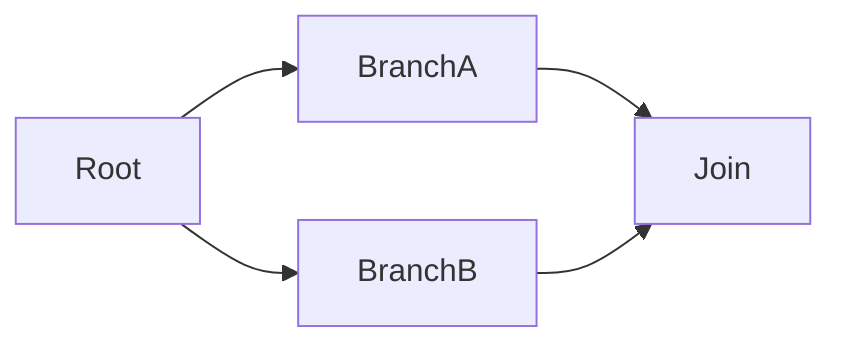

# RFC 022 - Test Dependencies

- [ ] Approved in principle
- [x] Under discussion
- [x] Implementation
- [ ] Shipped

## Summary

Add a `[DependsOn]` attribute to MSTest, plus equivalent **declarations in `testconfig.json`**, that let a test
declare which other tests must run before it. The declarations form a **directed acyclic graph**, not a
flat list: when several tests share a prerequisite they become runnable at the same moment and the
in-assembly parallel scheduler is free to run them concurrently. If a prerequisite does not pass, its
dependents are **skipped** rather than failed, and the skip propagates.

This extends the parallelization model of
[RFC 004 - In-assembly Parallel Execution](004-In-Assembly-Parallel-Execution.md) and reuses the
scheduling machinery introduced by [RFC 020 - Resource Lock Attribute](020-Resource-Lock-Attribute.md).

## Motivation

MSTest has no way to say "run B after A". The two ordering knobs it does have are deliberately coarse:

- `[Priority]` is **metadata only** — it is read at discovery (`TypeEnumerator.GetTestFromMethod`) and
  never consulted by the executor.
- `OrderTestsByNameInClass` (3.6) sorts alphabetically inside a class, and `RandomizeTestOrder` (4.3)
  exists precisely to *expose* accidental order dependencies.

Users have asked for this repeatedly — [#25](https://github.com/microsoft/testfx/issues/25) ("Add support
for ordered tests", open since 2016), [#3162](https://github.com/microsoft/testfx/issues/3162)
("Controlling execution order of unit tests"), [#572](https://github.com/microsoft/testfx/issues/572).
The legacy answer, Visual Studio's `.orderedtest` XML, only ever worked in MSTest V1 and is a pure linear
sequence with no branching, no failure semantics, and GUIDs that make it unauthorable by hand.

### Why this is not just an `[Order(int)]` attribute

An integer order is a *total* order: it serializes everything it touches, so a suite that needs one
setup step before twenty tests pays for nineteen unnecessary serializations. A graph is a *partial*
order: it constrains only the pairs that genuinely depend on each other and leaves everything else free
to run in parallel. That difference is the whole value proposition, and it is what separates the
frameworks that do this well (TestNG, TUnit) from the ones that only sort (NUnit `[Order]`, xUnit's
`ITestCaseOrderer`, JUnit's `MethodOrderer`).

It is also why the acceptance test for this feature asserts *overlap*, not just order.

### Prior art

| Framework | API | Failure → | Independent branches parallel | Cycles | File-based |
|---|---|---|---|---|---|
| **TUnit** | `[DependsOn(name / type / type+name)]`, `ProceedOnFailure` | **Skip** | **Yes** | DFS, up-front | No |
| **TestNG** | `@Test(dependsOnMethods, dependsOnGroups, alwaysRun)` | **Skip** | **Yes** | Yes | **Yes** (`testng.xml`) |
| **Playwright** | project `dependencies: [...]` | **Skip** | **Yes** | — | **Yes** (config) |
| **pytest** | `pytest-dependency` (`depends=[...]`) + `pytest-order` | **Skip** | No | No | No |
| **JUnit 5** | `@Order` / `MethodOrderer` only — dependencies deliberately rejected | — | No | — | properties |
| **NUnit / xUnit** | `[Order]` / `ITestCaseOrderer` — start order only | No | No | — | No |
| **MSTest (today)** | `[Priority]` (inert), `OrderTestsByNameInClass`, `RandomizeTestOrder` | — | — | — | sort options only |

The consensus among the frameworks that actually model dependencies is unanimous on four points, and
this design follows all four: **skip, don't fail**; **provide an escape hatch**; **detect cycles
eagerly**; **keep independent branches parallel**.

JUnit 5's refusal is a deliberate, well-argued position — test independence is a property worth
defending, and their non-obvious default ordering exists to stop people relying on order by accident.
This RFC does not dispute that for unit tests; see [Guidance](#guidance).

## Design

### API shape

Namespace `Microsoft.VisualStudio.TestTools.UnitTesting`:

```csharp
[AttributeUsage(AttributeTargets.Class | AttributeTargets.Method, AllowMultiple = true, Inherited = false)]
public sealed class DependsOnAttribute : Attribute
{
    public DependsOnAttribute(string testMethodName);              // a method of the same class
    public DependsOnAttribute(Type testClass);                     // every test of another class
    public DependsOnAttribute(Type testClass, string testMethodName);

    public Type? TestClass { get; }
    public string? TestMethodName { get; }
    public bool ProceedOnFailure { get; set; }
}
```

```csharp
[TestClass]
public class CheckoutTests
{
    [TestMethod]
    public void CreateCart() { }

    // Fan-out: both wait for CreateCart, then may run concurrently with each other.
    [TestMethod, DependsOn(nameof(CreateCart))] public void AddItem() { }
    [TestMethod, DependsOn(nameof(CreateCart))] public void ApplyCoupon() { }

    // Fan-in: waits for both.
    [TestMethod, DependsOn(nameof(AddItem)), DependsOn(nameof(ApplyCoupon))]
    public void PlaceOrder() { }

    // Runs even though its prerequisite failed.
    [TestMethod, DependsOn(nameof(PlaceOrder), ProceedOnFailure = true)]
    public void WriteAuditRecord() { }
}
```

### Design decisions

**Skip, don't fail, when a prerequisite fails.** A failing prerequisite means the dependent's
precondition demonstrably did not hold, so its result carries no information about the code it tests.
Failing it would report one bug as N failures and bury the root cause. Skipping reports one failure
surrounded by clearly-labelled skips. The skip message names the test that did not pass, because a skip
with no reason is indistinguishable from a test that was filtered out. This matches TestNG, TUnit,
pytest-dependency and Playwright's serial mode.

**`ProceedOnFailure` is per declaration, and merges conservatively.** A dependent proceeds only when
*every* edge it declares says it may; one edge asking for the ordinary skip is enough to hold it back. The
same rule applies when the *same* prerequisite is declared twice — for example at class scope with
`ProceedOnFailure = true` and again on the method with the default — so a broad opt-out can never silently
override a narrower declaration. Under-skipping runs a test whose precondition failed (a confusing spurious
failure); over-skipping only costs coverage that was already compromised. The conservative direction is
therefore to skip.

**Not inherited across overrides.** `[ResourceLock]` and `[DoNotParallelize]` are inherited because
over-applying them is merely slower. A dependency is different: carrying one concrete test's prerequisites
onto a method that *overrides* it creates an edge nobody wrote, on a method the author rewrote. That
direction fails *dangerous*, not *slow*, so `Inherited = false`. Note this is only about override chains -
a base-declared test method still runs as a test of each derived class, and its dependency travels with
it, resolved against the derived class so that each derived class orders its own copies of the two tests.
Dropping it there would silently discard the ordering the author declared.

**Cycles fail the tests in the cycle, and only those.** A cycle is a configuration error, so it is
reported before anything runs, as an error message naming the cycle path (`A > B > A`). The tests in the
cycle are reported as **failed** — they cannot be ordered, and silently skipping them would hide a bug in
the declarations. Everything outside the cycle still runs, so one bad declaration does not cost the whole
run. Tests downstream of the cycle are skipped by the ordinary "prerequisite did not pass" rule, with no
special case.

**A dependency that matches no test in the run is ignored, with a warning.** This is the single most
consequential trade-off in the design. Skipping the dependent instead would be "safer" in the abstract,
but it would make `--filter`, and running one test from an IDE, useless the moment that test has a
prerequisite — a well-known complaint about `pytest-dependency`. Debuggability wins; the warning keeps a
typo from being silent. `MSTEST0078` (see [Build-time validation](#build-time-validation)) catches the
genuinely misspelled references before the run.

**References are resolved at discovery.** `[DependsOn(typeof(X))]` is stored as `X.FullName`, because the
graph is rebuilt at execution time — possibly in another app domain — where the `Type` is gone. The
attribute is deliberately shaped so that `nameof` and `typeof` carry the reference, which makes a rename
a compile error rather than a silent no-op. This is the main thing TestNG's string-only
`dependsOnMethods` gets wrong.

### Scheduling: projecting a test graph onto chunks

MSTest does not schedule tests; it schedules **chunks** — a whole class under `ExecutionScope.ClassLevel`
(the default), a single test under `MethodLevel`. Dependencies are declared between *tests*. The test
graph is therefore projected onto chunks:

- an edge **inside** a chunk orders the tests within that chunk (topological sort, ties broken by
  declaration order so runs are reproducible);
- an edge **between** chunks gates when the dependent chunk may start.

A chunk becomes available the moment the last chunk it waits for **completes** — completion, not success,
because whether an individual test actually runs is decided per test, right before it starts, so that an
outcome recorded moments ago on another worker is always taken into account.



`BranchA` and `BranchB` are released together and run on different workers; `Join` waits for both.

#### Cycles that exist only in the projection

Under `ClassLevel`, class A's test can depend on class B's while another of B's depends on one of A's.
No test depends on itself — the test graph is sound — but the *class* graph has a cycle and cannot be
scheduled at class granularity. Dropping the ordering would be worse than losing the parallelism: the
run-time gate cannot distinguish "has not run yet" from "did not pass", so unordered dependents would be
**skipped nondeterministically** — varying with worker count and thread timing — while the run still
reported success. Instead, the tests of the classes caught in the cycle are moved into the **sequential
phase**, where the topological order is honoured exactly. Only those tests lose their parallelism;
unrelated classes keep theirs, and a warning names the classes and points at `MethodLevel` to get the
parallelism back.

This is reported as a *warning*, not an error: the declared order is still satisfied, so it is a
recoverable downgrade rather than the unschedulable configuration a real cycle represents.

#### `[DoNotParallelize]` and the demotion rule

Non-parallelizable tests run in a sequential phase *after* the parallel phase. A parallel test waiting on
a sequential prerequisite could therefore never observe it complete. The fix is to move the **dependent**,
transitively, into the sequential phase — not to move the prerequisite, which would break
`[DoNotParallelize]`'s own guarantee that such tests never run alongside anything else.

### Dependency declarations in `testconfig.json`

Some orchestration cannot, or should not, live in the test source: tests owned by another team, a chain
that reviewers want to read in one place, or an order maintained by someone who does not edit code. This
is what `testng.xml` and `playwright.config.ts` are for. MSTest already has a configuration file, so the
declarations go in it rather than in a format of their own:

```json
{
  "mstest": {
    "execution": {
      "dependencies": {
        "chains": [
          [
            "Contoso.Tests.SetupTests.CreateDatabase",
            "Contoso.Tests.ImportTests.ImportCatalog",
            "Contoso.Tests.CheckoutTests.PlaceOrder"
          ]
        ],
        "nodes": [
          {
            "test": "Contoso.Tests.ReportTests.WriteAudit",
            "dependsOn": [
              "Contoso.Tests.CheckoutTests.PlaceOrder",
              "Contoso.Tests.ImportTests.*"
            ],
            "proceedOnFailure": true
          }
        ]
      }
    }
  }
}
```

`chains` is the flat case — each entry waits for the one before it — and `nodes` is the tree case, where
one test names several prerequisites (fan-in) and several nodes may name the same one (fan-out). A test is
referenced by `Namespace.Class.Method`, or `Namespace.Class.*` for every test of a class.

**This is Microsoft.Testing.Platform only, by design.** `testconfig.json` is supplied only on the MTP path
— the VSTest entry points pass a null configuration (`MSTestDiscoverer.cs`: `configuration: null`) — so
configured dependencies are an MTP capability. A separate file format reachable from RunSettings was
considered and rejected: it would have meant a second syntax, a second parser and a second set of
diagnostics for the same concept, to serve a host that is being superseded. Tests running under VSTest
declare dependencies with the attribute, which works everywhere.

Configured edges are **merged** with attribute edges; neither overrides the other, and after parsing the
two are indistinguishable to the graph.

## Implementation

| Concern | Location |
|---|---|
| Attribute | `src/TestFramework/TestFramework/Attributes/Lifecycle/DependsOnAttribute.cs` |
| Carried edge | `src/Adapter/MSTestAdapter.PlatformServices/ObjectModel/TestDependencyInfo.cs` |
| Read at discovery | `TypeEnumerator.GetTestFromMethod` → `UnitTestElement.Dependencies` |
| VSTest transport | `AdapterTestProperties.DependenciesProperty`, `UnitTestElementExtensions` / `TestCaseExtensions` |
| Graph, cycles, chunking | `Execution/TestDependencyGraph.cs` |
| Run-time gate | `Execution/TestDependencyCoordinator.cs` |
| Configured edges | `Execution/TestDependencyDeclaration.cs`, `MSTestSettings.Configuration.cs` |
| Scheduler | `TestExecutionManager.Parallelization.cs` (`ExecuteTestsWithDependencyGraphAsync`, `ExecuteChunksInTopologicalOrderAsync`) |

`TestDependencyGraph.Build` returns `null` when no test in the source declares a dependency, and the
executor then takes exactly the path it takes today. This **fast path is deliberate**: the feature must
cost nothing for the overwhelming majority of runs that do not use it, and it keeps the existing
scheduling code reachable and unchanged rather than rewritten.

The ready-queue is a semaphore over a `ConcurrentQueue` of chunk indices: one permit per queued chunk,
plus one per worker once the last chunk completes, so every worker wakes and exits instead of blocking on
a queue that will never be fed again. Because the chunks caught in a projected cycle are demoted to the
sequential phase before scheduling, the chunk graph handed to the loop is always a DAG, so some chunk
always has no unmet prerequisite and the loop cannot deadlock. The bookkeeping that releases a chunk's
dependents runs in a `finally`, so a chunk that *throws* also cannot strand the workers waiting on it.

### Class and assembly cleanup

`ClassCleanupManager` counts down the tests of each class, and end-of-assembly cleanup is gated on
*every* class having reached zero (`ShouldRunEndOfAssemblyCleanup => _remainingTestCountsByClass.IsEmpty`).
The countdown is built from the tests that were **selected**, so a test whose outcome this feature decides
without running it — skipped because a prerequisite did not pass, or failed because it is in a cycle —
still owes its decrement. Left unaccounted, the class never completes: its `[ClassCleanup]` is silently
lost, and with it the whole assembly's `[AssemblyCleanup]`.

Both paths therefore call `UnitTestRunner.NotifyTestNotRunAsync`, which performs exactly the bookkeeping
a test dropped by an `ITestFilter` already does — the same situation of selected, counted, never run — so
the two features share one implementation rather than each growing their own.

### Testing

- `test/UnitTests/MSTestAdapter.PlatformServices.UnitTests/Execution/TestDependencyGraphTests.cs` — 24
  tests over resolution, fan-out independence, cycles (real and projection-only), demotion, the
  unmatched-reference warning, `ProceedOnFailure` merging, ordering determinism, and encode/decode.
- `test/IntegrationTests/MSTest.Acceptance.IntegrationTests/TestDependencyExecutionTests.cs` — end-to-end
  over net462/net8.0/net10.0. The assets record the millisecond each test body entered and left, and those
  timestamps assert the *ordering* guarantee only. Overlap of independent branches is proved structurally
  instead, by a bounded `CountdownEvent` that both branches must reach before either is released - a run
  that serialized them never satisfies it and fails on the timeout. Inferring overlap from wall-clock
  timings would be flaky on a loaded machine, so it is deliberately not done. Also covers skip propagation
  with `ProceedOnFailure`, cycle reporting, and the `testconfig.json` declarations (ordering via `chains`,
  plus fan-out from `nodes` where one dependent is skipped and a `proceedOnFailure` sibling still runs).

## Guidance

Test dependencies couple tests together and make a dependent impossible to run in isolation, which is why
they are a poor fit for unit tests, and why JUnit 5 rejects them outright. The
[2014 ISSTA study on test independence](https://homes.cs.washington.edu/~mernst/pubs/test-independence-issta2014.pdf)
found order-dependent tests in a quarter of the suites it examined, nearly all unintentionally.

Use `[DependsOn]` for multi-step integration and end-to-end suites where re-establishing expensive state
in every test is impractical, and prefer, in order:

1. **No dependency** — set state up in `[TestInitialize]` / `[ClassInitialize]`.
2. **A fixture** — if the state is expensive but shareable, `[AssemblyInitialize]` is cheaper than an edge.
3. **`[DependsOn]`** — when the *sequence itself* is the thing under test.

`RandomizeTestOrder` remains the tool for finding dependencies you did not declare.

## Build-time validation

**`MSTEST0078` reports the references that are statically decidable.** The runtime deliberately treats a
dependency that matches no test as a warning rather than a failure, so that `--filter` and single-test runs
keep working; that decision is only safe because build time catches the genuinely broken references. The
analyzer reports a named method that does not exist on the target type, a target that is not a test method
or not a test class, a target type from another assembly (dependencies are resolved within a single test
source, so such a reference matches nothing), a target that is an abstract test class (discovery enumerates
its tests under each concrete derived class, never under the abstract class's own name), a test that depends
on itself, a cycle visible within one compilation, and an attribute applied where it has no effect (a
non-test method, or a class discovery runs no test for — the attribute is not inherited, so an application
on a shared base class produces no edge).

It stays quiet whenever the answer depends on something the compilation does not know. The important case
is a test method declared on a class that discovery does not run directly — an unannotated base, or an
abstract `[TestClass]`: its implicit references (`[DependsOn(nameof(X))]` with no `typeof`) are resolved
against each concrete derived test class at run time, so the analyzer cannot decide them and leaves them
alone. It also models the *effective* method set, dropping base declarations that an override replaces,
because neither `[TestMethod]` nor `[DependsOn]` is inherited across an override chain.

## Future work

- **Per-data-row dependencies.** Naming a data-driven test currently creates an edge to *all* of its
  cases: the dependent waits for every row and is skipped if any row fails. Matching row *i* of B to row
  *i* of A is the hardest open problem in this space — even TUnit's mature implementation requires manual
  workarounds ([TUnit#1570](https://github.com/thomhurst/TUnit/issues/1570)) — so V1 documents the
  limitation rather than half-solving it.
- **Category dependencies**, the analogue of TestNG's `dependsOnGroups`, mapping onto `[TestCategory]`.
  The configuration's `Class.*` wildcard already covers the common case.
- **Cross-assembly dependencies.** The graph is per source, matching the scope of in-assembly
  parallelization.

## Unresolved questions

- Should a projection-only cycle under `ClassLevel` fall back to scheduling *only the affected classes* at
  method granularity, instead of demoting them to the sequential phase? That would keep some parallelism,
  at the cost of a scope that varies per class within one run.
- Should `RandomizeTestOrder` warn when it is combined with declared dependencies, as it already does for
  `OrderTestsByNameInClass`? The graph wins today, silently.
