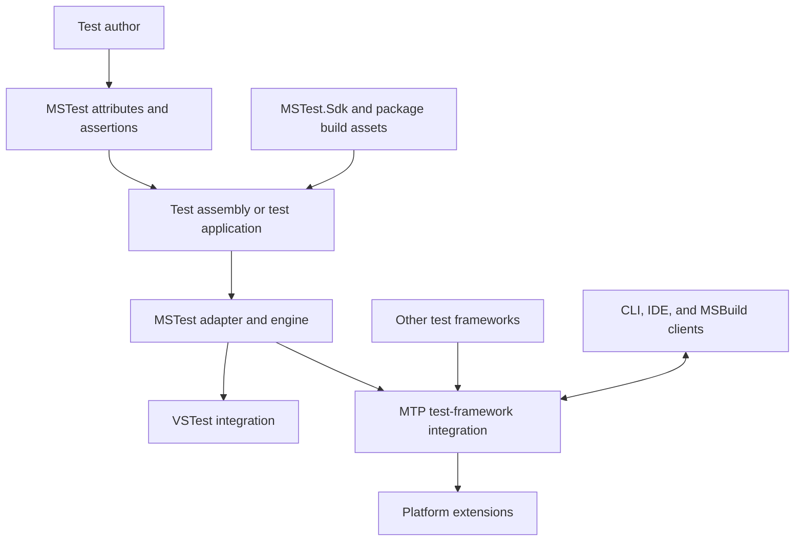

# MSTest and Microsoft.Testing.Platform architecture

MSTest is a test framework. Microsoft.Testing.Platform (MTP) is a test application platform. They are separate products: MSTest can run through VSTest or MTP, and MTP can host test frameworks other than MSTest through its extension contracts.

This index connects the source-inspected product baselines. See the [specification guide](../specifications/README.md) for assurance levels and maintenance rules, and the [audit](../specifications/audit.md) for existing-document dispositions.

## Product and component boundaries

| Component | Responsibility | Architecture and current contracts |
| --- | --- | --- |
| MSTest framework | Test attributes, assertions, test context, and framework extensibility APIs. | [MSTest architecture](mstest.md), [MSTest contracts](../specifications/mstest.md) |
| MSTest adapter and engine | Interpret MSTest metadata, discover tests, apply MSTest execution semantics, and integrate with a host. | [MSTest architecture](mstest.md) |
| MSTest analyzers and source generation | Compile-time diagnostics/code fixes and an alternative generated discovery/execution path with its own eligibility and fallback rules. | [MSTest architecture](mstest.md), [source-generator design](../source-generator/design.md) |
| MSTest.Sdk | Consumer build-time composition of framework, adapter, runner, and optional features. | [MSTest contracts](../specifications/mstest.md) |
| MTP core | Build and run a test application; compose services and extensions; coordinate requests, messages, output, and host lifecycle. | [MTP architecture](mtp.md), [MTP contracts](../specifications/mtp.md) |
| MTP extensions and MSBuild integration | Optional reporting, diagnostics, hosting bridges, launchers, and build/tool integration. Not all extensions are part of the core package. | [MTP architecture](mtp.md), [MTP contracts](../specifications/mtp.md) |

Source ownership follows the [repository layout](../../.github/copilot-instructions.md#repository-layout). Package composition and runtime ownership are different: a package reference is not proof that an extension is enabled, a service is owned by the platform, or a particular host mode executes.

## Runtime context

The following is a logical component map, not a guarantee that every mode uses the same process layout:

Generated MSTest execution is a distinct path described in the product architecture, not a claim that every test always passes through the reflection-based engine. Likewise, an out-of-process or packaged-app controller changes the process topology without making MTP and MSTest the same product.

## Which document owns a claim

| Claim | Primary location |
| --- | --- |
| MSTest eligibility, data expansion, fixtures, timeout, dependencies, or parallel scheduling | MSTest contract and its linked implementation/tests |
| Platform request/session lifecycle, message routing, option validation, filter-provider composition, or platform exit behavior | MTP contract and its linked implementation/tests |
| How an MSTest result becomes an MTP test-node update | MSTest host integration, with links to the MTP message contract |
| Wire payloads and protocol capabilities | Existing detailed protocol document, with the audit's implementation note and MTP contract |
| Why a change was proposed or an alternative rejected | Original RFC or decision note, not inferred solely from code |
| Installation, supported consumer setup, or package-specific activation | Package README, sample, or Microsoft Learn consumer guidance |

Avoid reproducing a protocol schema or every extension option in a product overview. Link the authoritative detailed document and record where that document differs from the current implementation.

## Validation boundary

The baseline documents distinguish source inspection and mapped test evidence from execution. They do not establish compatibility for an arbitrary combination of independently released MSTest, MTP, .NET SDK, IDE, reporting, or coverage packages.

For a change crossing those boundaries, specify the exact producer and consumer, ownership, lifecycle, capability/handshake behavior, cancellation, fallback, and exit semantics first. Then validate the real shipping layout and aligned packages on the intended release branch. The [specification guide](../specifications/README.md#keeping-the-baseline-current) describes how that evidence differs from documentation linting or repository-local unit tests.
