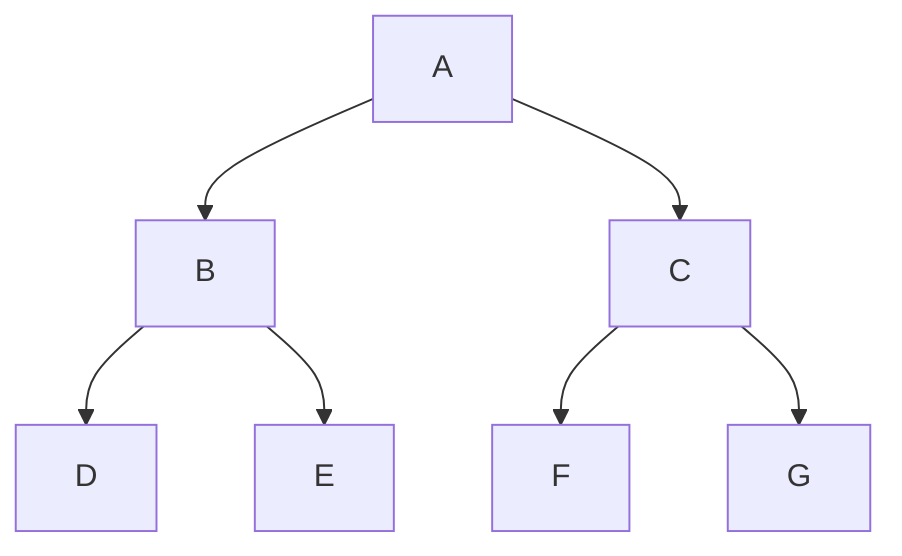

# Graph Query Filtering

**Authors:** [Marco Rossignoli](https://github.com/MarcoRossignoli) | [Amaury Levé](https://github.com/Evangelink)

When filtering nodes, we can filter by path and/or properties.

Available operators

- `&`    -> and
- `|`    -> or
- `()`   -> order, mandatory when defining multiple conditions
- `=`    -> equals
- `!=`   -> not equal
- `\*`   -> wildcard

## Filtering by path

Assuming the following graph

- `/`       -> all roots (returns list with only A in this case)
- `/A`      -> specific root node called A
- `/A/B`    -> Node B under root node A
- `/A/*`   -> All nodes directly under A
- `/A/B*`  -> All nodes under A whose name starts with B
- `/A/*B`   -> All nodes under A whose name ends with B
- `/A/*B*`  -> All nodes under A whose name contains with B

You can combine operators
`/A/(B*)&(!*C)`
-> All nodes under A whose name starts with B and does not end with C

In addition to all the previously mentioned operators, for path filtering we want to allow one more operator `**`.
`/A/**`
-> All nodes whatever the level under A

We don't want to allow `/A/**/B` as it would require to know the full graph to be able to check if the pattern is correct.

## Filtering node properties

Assuming the following graph

- `/**[P2=A]`                   -> All nodes where there is property with key `P2` -and value `A`
- `/**[P2=A\*]`                 -> All nodes where there is property with key `P2` -and value starts with `A`
- `/**[P2=\*A]`                 -> All nodes where there is property with key `P2` -and value ends with `A`
- `/**[P2=\*A\*]`               -> All nodes where there is property with key `P2` -and value contains `A`
- `/**[P2!=A]`                  -> All nodes where there is property with key `P2` -and value not `A`
- `/**[P2!=A\*]`                -> All nodes where there is property with key `P2` -and value does not start with `A`
- `/**[P2!=\*A]`                -> All nodes where there is property with key `P2` -and value does not end with `A`
- `/**[P2!=\*A\*]`              -> All nodes where there is property with key `P2` -and value does not contain `A`
- `/**[FunctionalTest=true]`    -> All nodes where there is property `FunctionalTest`
- `/**[FunctionalTest=false]`   -> All nodes where there is not property `FunctionalTest`

You can combine operators:

`/**[(P1=1)|(P2=*)]`

-> All nodes where there is property with key `P1` and value `1` OR property with key `P2` with any value

/!\ We don't want to allow values without key

/!\ Wildcard only apply to value of the property

## Real life examples

`/MyAssembly/MyNamespace/MyClass/MyTestMethod*[OS=Linux]`

From assembly MyAssembly, namespace MyNamespace and class MyClass, all methods whose name starts with MyTestMethod and where property `OS=Linux`.

`/MyAssembly/*/*/MyTestMethod*[OS=Linux]`

From assembly MyAssembly, any namespace or class, all methods whose name starts with MyTestMethod and where property `OS=Linux`.

`/MyAssembly/MyNamespace*/**[OS=Linux]`

From assembly MyAssembly, any namespace starting with MyNamespace of any class, all methods with property `OS=Linux`.
