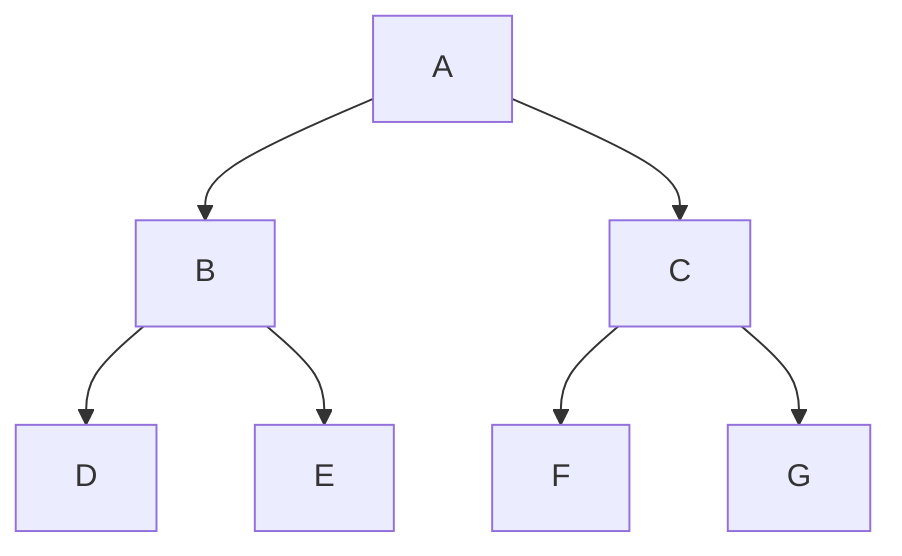

# Graph Query Filtering

> **Current implementation note (2026-10-09):** [Property matching](../../src/Platform/Microsoft.Testing.Platform/Requests/TreeNodeFilter/TreeNodeFilter.Matching.cs)
> and `TreeNodeFilterTests.Parameters_NegatedPropertyCheck` show that `Key!=Value` also matches a
> node with no matching metadata key. The examples below now reflect that behavior, use unescaped
> wildcard `*`, and treat `true`/`false` as literal metadata values rather than existence operators.
> [MTP-007](../specifications/mtp.md#mtp-007--selection-and-filter-composition) separates this grammar
> from framework support and extension-provider AND composition.

**Authors:** [Marco Rossignoli](https://github.com/MarcoRossignoli) | [Amaury Levé](https://github.com/Evangelink)

When filtering nodes, we can filter by path and/or properties.

Available operators

- `&`    -> and
- `|`    -> or
- `!`    -> unary NOT (must appear immediately after an opening parenthesis, e.g. `(!A*)`)
- `()`   -> order, mandatory when defining multiple conditions
- `=`    -> equals
- `!=`   -> not equal
- `*`    -> wildcard (`\*` matches a literal asterisk)

## Filtering by path

Assuming the following graph

```mermaid
graph TD;
A-->B;
A-->C;
B-->D;
B-->E;
C-->F;
C-->G;
```

- `/`       -> all roots (returns list with only A in this case)
- `/A`      -> specific root node called A
- `/A/B`    -> Node B under root node A
- `/A/*`   -> All nodes directly under A
- `/A/B*`  -> All nodes under A whose name starts with B
- `/A/*B`   -> All nodes under A whose name ends with B
- `/A/*B*`  -> All nodes under A whose name contains with B

You can combine operators
`/A/(B*)&(!*C)`
-> All nodes under A whose name starts with B and does not end with C

## Filtering with NOT

The `!` (unary NOT) operator negates a condition. It must appear immediately after an opening parenthesis.

- `/A/(!*Slow*)` -> All nodes under A whose name does not contain `Slow`
- `/A/(!*Integration*)` -> All nodes under A whose name does not contain `Integration`

## Filtering with the `**` path operator

In addition to all the previously mentioned operators, for path filtering we want to allow one more operator `**`.
`/A/**`
-> All nodes whatever the level under A

We don't want to allow `/A/**/B` as it would require to know the full graph to be able to check if the pattern is correct.

## Filtering node properties

Assuming the following graph

```mermaid
graph TD;
A-->B;
A-->C;
B-->D;
B-->E;
C-->F;
C-->G;
```

- `/**[P2=A]`                   -> All nodes where there is property with key `P2` -and value `A`
- `/**[P2=A*]`                  -> All nodes where there is property with key `P2` -and value starts with `A`
- `/**[P2=*A]`                  -> All nodes where there is property with key `P2` -and value ends with `A`
- `/**[P2=*A*]`                 -> All nodes where there is property with key `P2` -and value contains `A`
- `/**[P2!=A]`                  -> All nodes with no `P2` metadata value equal to `A` (including nodes without `P2`)
- `/**[P2!=A*]`                 -> All nodes with no `P2` metadata value starting with `A` (including nodes without `P2`)
- `/**[P2!=*A]`                 -> All nodes with no `P2` metadata value ending with `A` (including nodes without `P2`)
- `/**[P2!=*A*]`                -> All nodes with no `P2` metadata value containing `A` (including nodes without `P2`)
- `/**[FunctionalTest=true]`    -> All nodes with a `FunctionalTest` metadata value equal to `true`
- `/**[FunctionalTest=false]`   -> All nodes with a `FunctionalTest` metadata value equal to `false`
- `/**[FunctionalTest=*]`       -> All nodes with `FunctionalTest` metadata, regardless of its value
- `/**[FunctionalTest!=*]`      -> All nodes without `FunctionalTest` metadata

You can combine operators:

`/**[(P1=1)|(P2=*)]`

-> All nodes where there is property with key `P1` and value `1` OR property with key `P2` with any value

/!\ We don't want to allow values without key

/!\ Wildcard only apply to value of the property

> **Note for test framework authors**: The property filter syntax (`[Key=Value]`) evaluates against `TestMetadataProperty` entries in a node's `PropertyBag` only. Properties stored as other `IProperty` subtypes are silently not matched. To make test traits filterable via `--treenode-filter`, expose them as `TestMetadataProperty` instances.

## Real life examples

`/MyAssembly/MyNamespace/MyClass/MyTestMethod*[OS=Linux]`

From assembly MyAssembly, namespace MyNamespace and class MyClass, all methods whose name starts with MyTestMethod and where property `OS=Linux`.

`/MyAssembly/*/*/MyTestMethod*[OS=Linux]`

From assembly MyAssembly, any namespace or class, all methods whose name starts with MyTestMethod and where property `OS=Linux`.

`/MyAssembly/MyNamespace*/**[OS=Linux]`

From assembly MyAssembly, any namespace starting with MyNamespace of any class, all methods with property `OS=Linux`.
