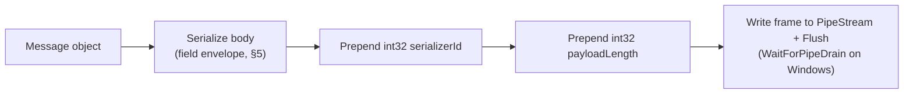
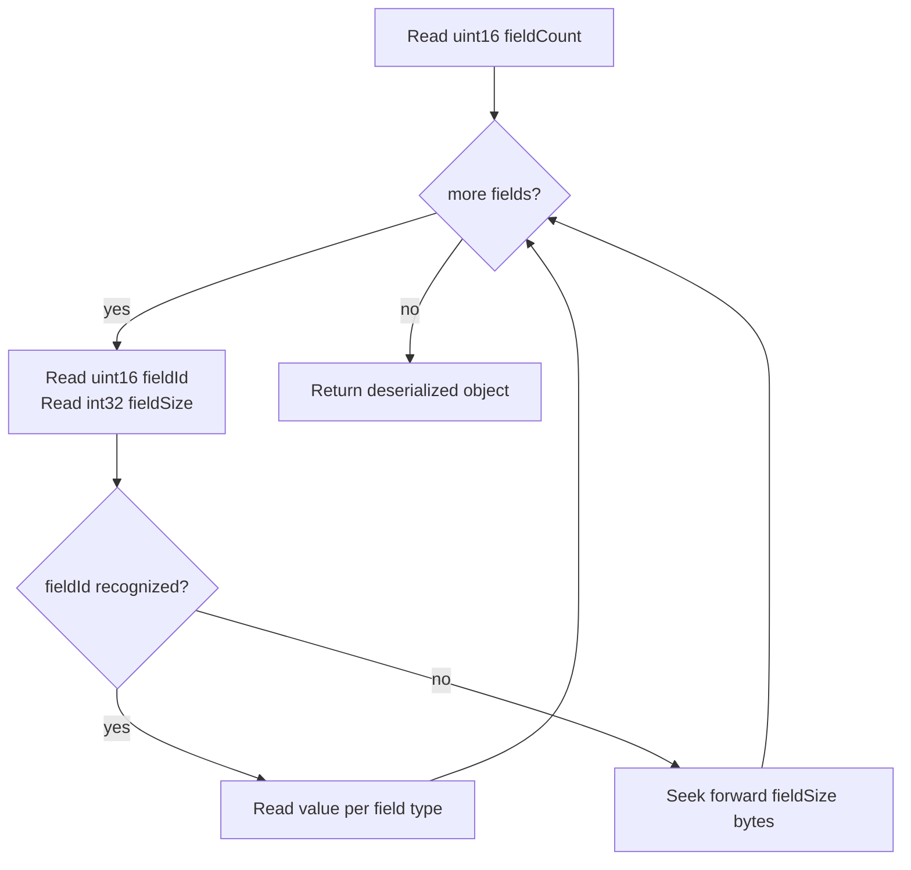
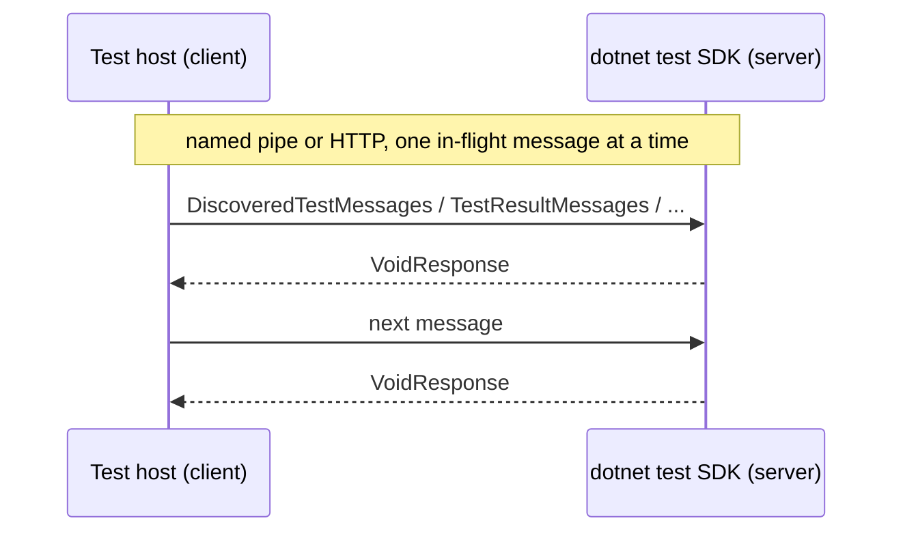
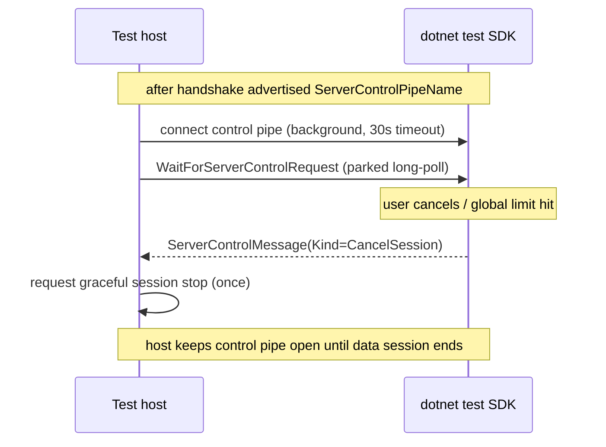
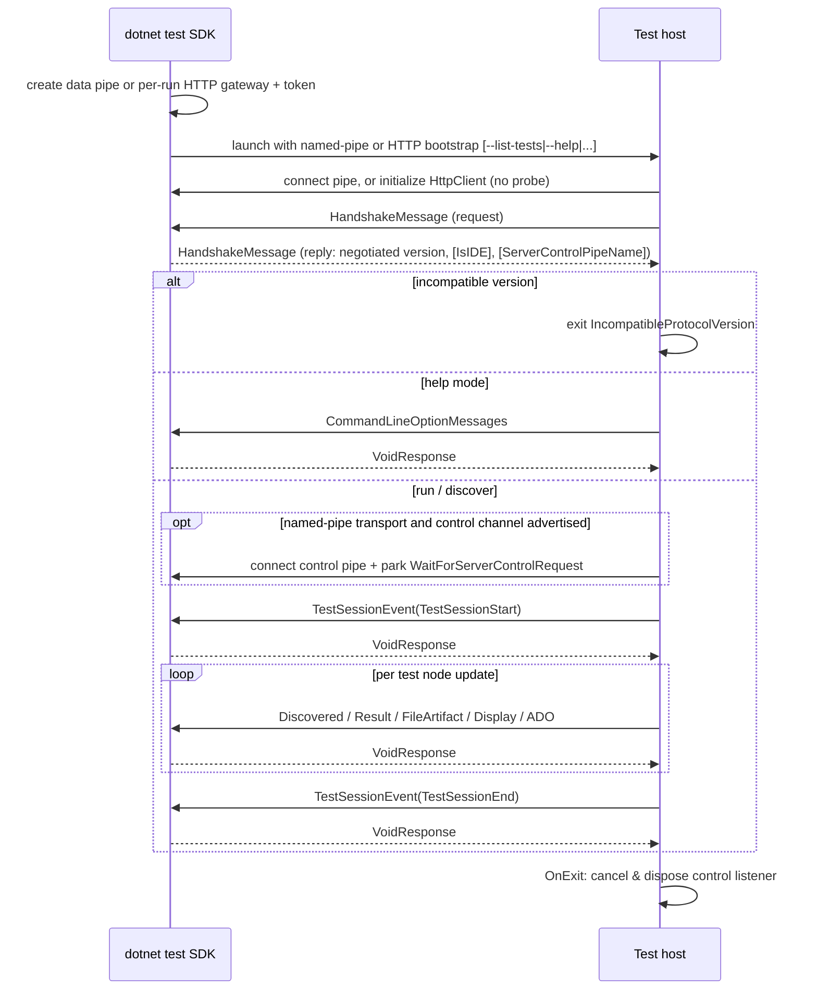

# 004 - `dotnet test` Binary Protocol

This document is the descriptive specification of the **`dotnettestcli` protocol**: the small,
versioned, **binary** protocol used between a Microsoft.Testing.Platform (MTP) test application and the
`dotnet test` implementation shipped in the .NET SDK. The protocol can be bootstrapped over the legacy
named-pipe transport or over authenticated HTTP request/reply for environments such as
`browser-wasm`.

It is a *different* protocol from the [JSON-RPC server-mode protocol](./001-protocol-intro.md):

| | JSON-RPC server mode | `dotnet test` pipe protocol (this doc) |
| --- | --- | --- |
| Activation | `--server` (or `--server jsonrpc`) | `--server dotnettestcli` plus named-pipe or HTTP bootstrap options |
| Wire format | JSON-RPC 2.0 over stdio / TCP | Custom length-prefixed **binary** frames over a named pipe or HTTP POST bodies |
| Shape | Full request/response + notifications, bidirectional | **Push-only** data channel (host → SDK) + auxiliary reverse control channel |
| Role of the runner | Server | Client (connects out to the SDK's pipe server) |

> [!IMPORTANT]
> **Source of truth.** The wire contract (serializer IDs, field IDs, handshake/session/state
> constants, message models, and serializers) lives in
> `src/Platform/Microsoft.Testing.Platform/ServerMode/DotnetTest/IPC/` and
> `src/Platform/Microsoft.Testing.Platform/IPC/`. Those files are **vendored (hand-copied) into
> `dotnet/sdk`**. testfx is authoritative; any change to the shared files is a coordinated,
> potentially breaking, wire-protocol change. The enumeration of shared files is
> `ServerMode/DotnetTest/DotnetTestProtocolContract.props`.
>
> **Shared wire contract vs. per-repo transport.** Only the *wire contract* (serializer/field IDs,
> message models, serializers, handshake/state constants) is shared source. The **transport**
> (framing loop, buffering, connection-loss reactions, authentication, unknown-message handling, endpoint
> or pipe-name resolution) is deliberately **not** shared and is implemented independently on each side.
> Wherever this document describes transport
> *behavior*, it describes testfx's implementation. The current `dotnet/sdk` data-pipe server implements
> its own transport and **diverges** in several places (called out inline below); such behaviors are not
> protocol guarantees and must not be assumed to be symmetric across both sides.

---

## 1. Terminology

- **Test application / test host** — the MTP-based test executable (the process being run by
  `dotnet test`). In this protocol it is the named-pipe or HTTP **client**.
- **SDK / `dotnet test`** — the .NET SDK component that launches test applications and renders their
  output. It is the **pipe server** (it creates and listens on the data pipe).
- **Primary channel** — the host-initiated request/reply channel carrying all handshakes and test data.
  It is either the data pipe or the HTTP gateway endpoint.
- **Data pipe** — the legacy primary-channel named pipe, whose OS name is supplied via
  `--dotnet-test-pipe`.
- **HTTP gateway** — the SDK-side per-run endpoint that receives authenticated binary HTTP POSTs and
  returns one binary reply per request.
- **Server-control pipe** — an optional *reverse* named pipe, created and listened on by the SDK, used
  to push control signals (today only session cancellation) SDK → host. Its name is advertised in the
  handshake reply.
- **Execution ID** — a GUID (`"N"` format) identifying one **test-application execution** (one root
  test-app process and its child process tree). It is shared across that test host, its test host
  controller, and its orchestrator processes via an environment variable. It is **not** a per-CLI-command
  identifier: a single `dotnet test` command that launches several test applications (e.g. a
  multi-project run) gives each root test application its **own** Execution ID by default.
- **Instance ID** — a GUID (`"N"` format) identifying one specific connecting process/`DotnetTestConnection`.
- **Attempt number** — a 1-based retry generation within one Execution ID. Attempt `1` is the initial run.
  Multiple test-host instances (for example, shards) can belong to the same attempt; a new Instance ID does
  not by itself imply a retry.
- **Session UID** — the MTP test session identifier for a run.

---

## 2. Activation & configuration

The legacy SDK bootstrap remains:

```text
<testapp> --server dotnettestcli --dotnet-test-pipe <osPipeName> [other options]
```

For HTTP the SDK starts the test application with:

```text
<testapp> --server dotnettestcli
  --dotnet-test-transport http
  --dotnet-test-http-endpoint <absoluteUrl>
  --dotnet-test-http-token <perRunBearerToken>
  [other options]
```

Rules and behavior:

- `--server` accepts zero or one argument. The value `dotnettestcli` (case-insensitive) selects this
  protocol. `--server jsonrpc` (or `--server` with no value) selects JSON-RPC server mode instead.
- Omitting `--dotnet-test-transport` preserves the legacy behavior: `--dotnet-test-pipe` implicitly
  selects the named-pipe transport.
- `--dotnet-test-transport` accepts `pipe` or `http`. Explicit `pipe` requires
  `--dotnet-test-pipe`; explicit `http` requires both HTTP options and rejects a pipe option.
- `--dotnet-test-pipe` takes **exactly one** argument: the fully-resolved OS pipe name/path the SDK is
  already listening on (see §3).
- `--dotnet-test-http-endpoint` must be an absolute HTTPS URL. Plain HTTP is accepted only for a
  loopback host. User information, query strings, and fragments are rejected.
- `--dotnet-test-http-token` is a non-empty bearer token without whitespace or control characters.
  It is per-run bootstrap material, must have enough entropy to be unguessable, and must not be logged.
- All bootstrap options are built-in and **hidden**: the platform omits them from `--help`, so they are
  only listed by `--info`. They are pre-launch SDK/host integration options, not direct end-user options.

### Environment variables

| Variable | Set by | Purpose |
| --- | --- | --- |
| `TESTINGPLATFORM_DOTNETTEST_EXECUTIONID` | The root test application on first connect (if not already set) | The Execution ID. Each root test-app process generates its own value in `AfterCommonServiceSetupAsync` (if unset) and propagates it via the environment **only to its child process tree** (its test host controller, orchestrator). So all handshakes *within one test-application execution* share it, but separate test applications launched by one multi-project `dotnet test` command normally get **different** IDs. If already present it is **not** overwritten. |
| `TESTINGPLATFORM_DOTNETTEST_ATTEMPTNUMBER` | Retry orchestrator | The positive, 1-based retry attempt assigned to a child test host. A normal test host reports attempt `1` when the variable is absent. Invalid values fail before the handshake instead of being silently reinterpreted. |
| `TESTINGPLATFORM_PIPE_DIRECTORY` | User (optional) | On Unix, overrides the directory used to place the domain-socket file, **for pipes created by testfx's `NamedPipeServer`** (see §3). It does **not** relocate a pipe created by the other side: the current `dotnet/sdk` data-pipe server still resolves Unix names as `Path.Combine("/tmp", name)` and does not honor this variable/`TMPDIR` (nor the 103-byte precheck). Since the SDK creates the data pipe, this variable effectively only affects pipes testfx itself creates (e.g. the sibling controller pipe). |

---

## 3. Transport bootstrap & security

| Concern | Named pipe | Authenticated HTTP |
| --- | --- | --- |
| Bootstrap | `--dotnet-test-pipe <resolvedName>`; implicit default or `--dotnet-test-transport pipe` | `--dotnet-test-transport http` + endpoint + per-run token |
| Access control | Current-user pipe ACL on .NET plus OS pipe naming | HTTPS (except loopback HTTP) plus bearer authentication on every POST |
| Protocol bytes | One complete existing frame per write/read | One complete existing frame per request/response body |
| Ordering | One request/reply under the client lock | One POST in flight under the same ordering lock |
| Versioning | Handshake negotiates the existing serializer/message contract | Identical handshake and versions; HTTP is bootstrap/transport only |
| Disconnect signal | Persistent pipe EOF/write failure | No persistent signal; failure appears on the current or next POST |
| Browser considerations | Unavailable on browser/WASI | `HttpClient`/fetch; gateway must support CORS/PNA preflight |
| Cost | Persistent local stream | HTTP headers, possible preflight, and request setup per protocol message |

### 3.1 Named pipe

The pipe is a `System.IO.Pipes` named pipe opened as `PipeDirection.InOut`,
`PipeTransmissionMode.Byte`, `PipeOptions.Asynchronous`, and — on .NET (Core) — `PipeOptions.CurrentUserOnly`
(hardens the ACL so only the current user can connect).

**Pipe name resolution invariant:** the process that *creates* the pipe (the SDK for the data pipe; the
SDK for the control pipe) resolves the name locally and hands the **fully-resolved** value to the peer.
The peer uses it verbatim and never recomputes it. This keeps the SDK and host versions decoupled.

`NamedPipeServer.GetPipeName(name)` (testfx's server-side helper) computes the OS name:

- **Windows:** `testingplatform.pipe.<name-with-'\'-replaced-by-'.'>`.
- **Unix:** a domain-socket **file path** `Path.Combine(<directory>, name)` where `<directory>` is
  resolved with precedence:
  1. `TESTINGPLATFORM_PIPE_DIRECTORY` (explicit override; created & write-probed, fails fast with an
     actionable message if unusable),
  2. `Path.GetTempPath()` (honors `TMPDIR`),
  3. `/tmp` (legacy default).
  The path is normalized to an absolute path. Its UTF-8 byte length must be ≤ **103** bytes
  (`sockaddr_un.sun_path` budget: 104 − 1 for the NUL terminator, using macOS' smaller limit for
  portability); otherwise creation fails fast.

> [!NOTE]
> This resolution describes testfx's `NamedPipeServer`. On the **data** pipe the SDK is the creator, and
> the current `dotnet/sdk` server resolves Unix names as `/tmp/<name>` only (no
> `TESTINGPLATFORM_PIPE_DIRECTORY`/`TMPDIR` relocation and no 103-byte precheck). Because the peer always
> uses the fully-resolved name verbatim, this divergence is harmless for interop — it only changes *where*
> the SDK's socket file lands. The test host simply opens a `NamedPipeClient` to `.`/`<name>`.

### 3.2 Authenticated HTTP

The HTTP transport uses ordinary .NET `HttpClient`; on `browser-wasm` this flows through the runtime's
browser `fetch` implementation. It requires no custom JavaScript shim.

For each host request the client sends:

```http
POST <per-run-endpoint>
Authorization: Bearer <per-run-token>
Content-Type: application/octet-stream

<one complete protocol frame>
```

The gateway replies with a successful status and `application/octet-stream` body containing exactly one
complete reply frame. The host validates success status, framing, response type, and the absence of a
second frame. A semaphore permits exactly one request in flight, preserving the same ordering and
backpressure as the named pipe. `ConnectAsync` performs no probe: the handshake is the first POST, avoiding
an otherwise redundant browser preflight.

The SDK-side gateway contract is:

1. Create a unique endpoint and cryptographically strong bearer token for each launched test-application
   run. Do not reuse either across unrelated runs.
2. Authenticate every POST before decoding or dispatching its body. Compare credentials without logging
   them, and never place the token in a URL.
3. Accept exactly one existing protocol request frame and return exactly one existing protocol reply
   frame. Do not translate serializer IDs, field IDs, framing, or negotiated versions.
4. Serialize handling per host connection/run. The host already limits itself to one request in flight;
   the gateway must not reorder requests across asynchronous handlers.
5. Keep the endpoint available for the entire run and return explicit non-success status codes for
   authentication or gateway failures. There is no health polling.
6. Bound request and response sizes, reject malformed or trailing frames, and avoid buffering/logging
   bodies in diagnostics because protocol payloads can contain test names, paths, and output.

#### Browser CORS and Private Network Access

An actual browser applies CORS, and may apply Private Network Access (PNA), even when a Node-hosted
`browser-wasm` acceptance test does not. The gateway must:

- allow the test application's exact origin (not `*` when credentials or policy require a specific
  origin);
- allow `POST`, `Authorization`, and `Content-Type`;
- answer `OPTIONS` preflight without requiring the bearer header that the browser has not sent yet;
- include the matching CORS response headers on success and error responses;
- account for PNA preflight when a public or secure origin targets a loopback/private-network gateway
  (including `Access-Control-Allow-Private-Network: true` where the browser requires it); and
- use HTTPS for non-loopback endpoints to avoid mixed-content and bootstrap validation failures.

This adds preflight and per-request HTTP overhead compared with a persistent WebSocket or named pipe, but
substantially reduces browser-specific host code and reuses the platform `HttpClient` stack.

---

## 4. Framing

Every message — request and reply, on the primary channel and control pipe — is a single frame:

```text
+-------------------------+------------------------+------------------------+
| int32  payloadLength    | int32  serializerId    | byte[] body            |
| (little-endian)         | (little-endian)        | (serializerId's shape) |
+-------------------------+------------------------+------------------------+
        4 bytes                   4 bytes                 N bytes

payloadLength = 4 (serializerId) + body.Length
```

- All multi-byte integers use `BitConverter` (little-endian on all supported platforms).
- The reader first reads exactly 4 bytes (`payloadLength`), then reads exactly `payloadLength` bytes
  (which contain the 4-byte `serializerId` followed by the body), looping over partial reads.
- `serializerId` selects the deserializer from the shared registry (§6).
- **EOF handling:** a `0`-byte read (clean disconnect, whether at a frame boundary or mid-message) makes
  the reader return `null`, which the transport interprets as "peer disconnected". See §11 for the
  behavioral consequences.
- On Windows, testfx's frame writer calls `WaitForPipeDrain()` after each write to ensure the frame is
  flushed to the peer before returning. This is a **testfx transport detail, not a bidirectional
  requirement**: it applies to the testfx client's *request* writes (and testfx's server); the current
  `dotnet/sdk` reply writer only writes + flushes and has no drain call. A conforming reader must not
  depend on the peer draining.
- The read buffer is 250,000 bytes; larger bodies are streamed in chunks.



---

## 5. Body serialization format

Bodies use a **self-describing, forward-compatible field envelope**. The design follows the concept of
**optional properties**: each field carries an ID and a size, unknown IDs are skipped, and new fields
are added with new IDs. Existing IDs are **never** reused or repurposed.

### 5.1 Standard field envelope

Most messages are:

```text
uint16  fieldCount
repeat fieldCount times:
    uint16  fieldId
    int32   fieldSize      // size in bytes of the following value
    byte[]  value          // interpretation depends on fieldId
```

- `fieldCount` counts only the fields actually present. **Optional (null) fields are omitted entirely**
  — the writer computes `fieldCount` from the non-null fields. A reader must therefore treat any absent
  field as "not provided" and apply its own default.
- On an **unrecognized `fieldId`**, the reader skips exactly `fieldSize` bytes and continues. This is
  what makes older readers forward-compatible with newer producers.



### 5.2 Primitive value encodings

| Type | Encoding | `fieldSize` written |
| --- | --- | --- |
| `string` | `int32 byteLength` + UTF-8 bytes | For a scalar field written via `WriteField(id, string)`, the emitted `int32` **is** the envelope `fieldSize` (the UTF-8 byte length), followed directly by the raw UTF-8 bytes — there is no second length prefix. Strings that are **list elements** carry their own `int32 byteLength` prefix instead. See note below. |
| `int` | 4 bytes | `4` |
| `long` | 8 bytes | `8` |
| `ushort` | 2 bytes | `2` |
| `bool` | 1 byte | `1` |
| `byte` | 1 byte | `1` |

> [!NOTE]
> **Two string conventions coexist and are both part of the contract.**
>
> - Scalar string fields written with `WriteField(stream, id, value)` emit `uint16 id`, then an
>   `int32` byte length, then the raw UTF-8 bytes. That `int32` is exactly the envelope `fieldSize`,
>   so the reader reads it as the size and calls `ReadStringValue(stream, size)` — there is **no**
>   second length prefix inside the value.
> - Strings inside a **list payload element** (e.g. `ParameterTypeFullNames`) are written with
>   `WriteString` (a self-contained `int32 len` + bytes) and read with `ReadString`.
>
> Implementers must follow the exact per-serializer layout (each serializer file has a byte-layout
> comment). The round-trip contract tests
> (`test/UnitTests/Microsoft.Testing.Platform.DotnetTestProtocolContract.UnitTests`) pin the bytes.

### 5.3 List payloads (deferred size back-fill)

List-valued fields (e.g. the message lists inside the "*Messages" envelopes) are written as:

```text
uint16  fieldId
int32   payloadSize        // reserved, back-filled after writing the payload
int32   listLength
repeat listLength times:
    <element>              // usually a nested field envelope (§5.1)
```

The writer reserves the 4-byte `payloadSize`, writes `listLength` + elements, then seeks back and
patches `payloadSize` with the number of bytes written. This requires a **seekable** stream
(a `MemoryStream` is used for buffering before the frame hits the pipe). A `null`/empty list writes
nothing at all (the field is omitted and not counted in `fieldCount`).

### 5.4 Execution-scoped header

The four list-carrying `dotnet test` messages (`DiscoveredTestMessages`, `TestResultMessages`,
`TestInProgressMessages`, `FileArtifactMessages`) share two leading fields with pinned IDs:

- `ExecutionId` — field ID **1**
- `InstanceId` — field ID **2**

Both are optional strings; the message-specific list field(s) follow. `AzureDevOpsLogMessage` and
`DisplayMessage` also place `ExecutionId`/`InstanceId` at IDs 1/2 but carry scalar payloads (not lists).

---

## 6. Serializer registry (message IDs)

All serializers are registered in one registry shared by both pipes
(`RegisterSerializers.RegisterAllSerializers`). **IDs are frozen for backwards compatibility** — never
change or reuse an ID.

| ID | Message | Direction (data pipe) | Kind | Since |
| --: | --- | --- | --- | --- |
| 0 | `VoidResponse` | SDK → host (reply) | Response | 1.0.0 |
| 1 | `TestHostCompletedRequest` | *test host controller pipe* | Request | 1.0.0 |
| 2 | `TestHostProcessPIDRequest` | *test host controller pipe* | Request | 1.0.0 |
| 3 | `CommandLineOptionMessages` | host → SDK | Request | 1.0.0 |
| 4 | *(reserved — removed serializer)* | — | — | — |
| 5 | `DiscoveredTestMessages` | host → SDK | Request | 1.0.0 |
| 6 | `TestResultMessages` | host → SDK | Request | 1.0.0 |
| 7 | `FileArtifactMessages` | host → SDK | Request | 1.0.0 |
| 8 | `TestSessionEvent` | host → SDK | Request | 1.0.0 |
| 9 | `HandshakeMessage` | host → SDK, and SDK → host reply | Request + Response | 1.0.0 |
| 10 | `TestInProgressMessages` | host → SDK¹ | Request | 1.0.0 |
| 11 | `AzureDevOpsLogMessage` | host → SDK | Request | 1.2.0 |
| 12 | `DisplayMessage` | host → SDK | Request | 1.3.0 |
| 13 | `WaitForServerControlRequest` | host → SDK (on control pipe) | Request | 1.4.0 |
| 14 | `ServerControlMessage` | SDK → host reply (on control pipe) | Response | 1.4.0 |

> IDs 1 and 2 belong to the sibling **test host controller** pipe (a monitoring channel between a test
> host controller process and the test host). They share the same framing and registry but are not part
> of the SDK data flow; they are listed here because they occupy IDs in the shared registry.
>
> ¹ `TestInProgressMessages` (ID 10) is registered and round-tripped but is **not currently emitted** on
> the data pipe — see §9.4.

---

## 7. Request/reply model

Although data flows host → SDK, the primary channel is entirely **host-initiated request/reply**: the
host sends one request frame and waits for exactly one reply frame before sending the next. This
serializes all sends behind a single lock (`RequestReplyAsync` holds a `SemaphoreSlim`), so messages are
delivered in order.

- For every data message the SDK replies with a **`VoidResponse`** (serializer ID 0, empty body). The
  host ignores the value; it only needs the reply to know the SDK consumed the message and to unblock
  the next send.
- The one exception is the **handshake**: the SDK replies with a `HandshakeMessage` (§9), not a
  `VoidResponse`.

The protocol is therefore "push-only" from a *semantic* standpoint (the SDK never initiates a primary
channel request), but every push is acknowledged. HTTP needs no polling because there is no SDK-initiated
primary-channel traffic to retrieve.



---

## 8. Handshake & version negotiation

Before any data is sent, the host performs one handshake round-trip on the selected primary transport.

### 8.1 Host → SDK: `HandshakeMessage` (request)

A `HandshakeMessage` body is a map `byte -> string`:

```text
uint16  propertyCount
repeat propertyCount times:
    byte    propertyId
    string  value          // int32 len + UTF-8 bytes
```

Property IDs (`HandshakeMessagePropertyNames`):

| ID | Name | Set by host | Meaning |
| --: | --- | --- | --- |
| 0 | `PID` | yes | Host process ID. |
| 1 | `Architecture` | yes | `RuntimeInformation.ProcessArchitecture`. |
| 2 | `Framework` | yes | `RuntimeInformation.FrameworkDescription`. |
| 3 | `OS` | yes | `RuntimeInformation.OSDescription`. |
| 4 | `SupportedProtocolVersions` | yes | Semicolon-separated list the host supports (see §10). |
| 5 | `HostType` | yes | `TestHost`, `TestHostController`, `ServerTestHost`, `TestHostOrchestrator`, or `ArtifactPostProcessor`. |
| 6 | `ModulePath` | yes | Full path of the test application. |
| 7 | `ExecutionId` | yes | The Execution ID (from the env var). |
| 8 | `InstanceId` | yes | The per-connection Instance ID. |
| 9 | `IsIDE` | **reply-only** | Consumer requests full discovery details (see §9). |
| 10 | `ExecutionMode` | yes | `run`, `help`, `discover`, or `tool` — lets the SDK detect mismatches (e.g. `--help` leaking into a run). |
| 11 | `OrchestratorFeature` | orchestrator only | The orchestrator extension Uid (e.g. retry). |
| 12 | `ServerControlPipeName` | **reply-only** | OS name of the reverse control pipe (see §12). |
| 13 | `AttemptNumber` | test host only | Positive, 1-based retry attempt. Multiple Instance IDs may share one attempt. |
| 14 | `SupportedPostProcessorKinds` | test host, server test host, test host controller, or artifact post-processor | Semicolon-separated reverse-DNS artifact kinds supported by registered post-processors. |
| 15 | `SupportedPostProcessorExtensionsLegacy` | test host, server test host, test host controller, or artifact post-processor | Semicolon-separated lowercase file extensions used as a fallback for untagged artifacts. |

### 8.2 SDK → host: `HandshakeMessage` (reply)

The SDK replies with its own `HandshakeMessage`. The host reads these properties:

- `SupportedProtocolVersions` (ID 4): the **single** version the SDK negotiated. The host checks it is
  in its own supported set; if not, the run is treated as **incompatible** (exit code
  `IncompatibleProtocolVersion`).
- `IsIDE` (ID 9): when `"true"`, the host streams **full** discovery details and streams per-test
  in-progress updates as results (see §9).
- `ServerControlPipeName` (ID 12): when non-empty, enables the reverse control channel (§12). This is a
  **capability signal gated on the property's presence**, independent of the version string.

### 8.3 Negotiation algorithm

The host advertises `ProtocolConstants.SupportedVersions` (currently `"1.0.0;1.1.0;1.2.0;1.3.0;1.4.0"`).
The SDK picks the **highest version present in both sets** and returns that single value. The host then:

- Confirms the returned value is in its supported set (compatibility gate).
- Derives feature flags from the negotiated `Version`:
  - `IsLogForwardingSupported` = negotiated ≥ `1.2.0`
  - `IsDisplayMessageForwardingSupported` = negotiated ≥ `1.3.0`

```mermaid
sequenceDiagram
    participant H as Test host
    participant S as dotnet test SDK
    H->>S: HandshakeMessage(PID, OS, SupportedProtocolVersions="1.0.0;...;1.4.0", HostType, ExecutionId, InstanceId, ExecutionMode, [AttemptNumber], ...)
    S->>S: pick highest mutually-supported version
    S-->>H: HandshakeMessage(SupportedProtocolVersions=<negotiated>, [IsIDE], [ServerControlPipeName])
    H->>H: validate compatibility; set IsIDE / forwarding / control-channel flags
    alt incompatible
        H->>H: exit IncompatibleProtocolVersion
    else compatible
        H->>H: proceed to run/discover/help
    end
```

---

## 9. Message catalog (data pipe)

Every message below is a host → SDK request answered with a `VoidResponse`. `ExecutionId`/`InstanceId`
are the execution-scoped header fields (IDs 1/2) unless noted.

### 9.1 `TestSessionEvent` (ID 8)

Sent at the boundaries of the test session.

| Field ID | Name | Type | Notes |
| --: | --- | --- | --- |
| 1 | `SessionType` | byte | `SessionEventTypes`: `0` = TestSessionStart, `1` = TestSessionEnd. |
| 2 | `SessionUid` | string | The MTP session UID. |
| 3 | `ExecutionId` | string | Execution ID. |

The host sends `TestSessionStart` on session start and `TestSessionEnd` on session finish. (Note: this
message's field IDs 1/2/3 are `SessionType`/`SessionUid`/`ExecutionId` — it does **not** use the shared
execution-scoped header helper.)

### 9.2 `DiscoveredTestMessages` (ID 5)

Emitted for every discovered test (state `Discovered`). Carries a list of `DiscoveredTestMessage`:

| Field ID | Name | Type | Populated when |
| --: | --- | --- | --- |
| 1 | `Uid` | string | always |
| 2 | `DisplayName` | string | always |
| 3 | `FilePath` | string | IDE only |
| 4 | `LineNumber` | int | IDE only |
| 5 | `Namespace` | string | IDE only |
| 6 | `TypeName` | string | IDE only |
| 7 | `MethodName` | string | IDE only |
| 8 | `Traits` | list of `TraitMessage`(`Key`,`Value`) | IDE only |
| 9 | `ParameterTypeFullNames` | list of string | IDE only |

> **`IsIDE` gating.** In non-IDE runs (e.g. plain `dotnet test`) only `Uid` + `DisplayName` are sent to
> keep the payload minimal. When the SDK set `IsIDE=true` in its handshake reply (an IDE, or
> `dotnet test --list-tests json`) the host sends the full location/identifier/traits details.

### 9.3 `TestResultMessages` (ID 6)

Carries two lists: `SuccessfulTestMessageList` (ID 3) and `FailedTestMessageList` (ID 4).

Mapping from MTP node state → which list is used:

| MTP state | `State` byte (`TestStates`) | Sent as |
| --- | --: | --- |
| Passed | 1 | Successful list |
| Skipped | 2 | Successful list |
| InProgress (IDE only) | 7 | Successful list |
| Failed | 3 | Failed list |
| Error | 4 | Failed list |
| Timeout | 5 | Failed list |
| Cancelled | 6 | Failed list |

`SuccessfulTestResultMessage` fields: `Uid`(1), `DisplayName`(2), `State`(3, byte), `Duration`(4, long
ticks), `Reason`(5), `StandardOutput`(6), `ErrorOutput`(7), `SessionUid`(8).

`FailedTestResultMessage` fields: `Uid`(1), `DisplayName`(2), `State`(3), `Duration`(4), `Reason`(5),
`ExceptionMessageList`(6), `StandardOutput`(7), `ErrorOutput`(8), `SessionUid`(9), `Expected`(10),
`Actual`(11).

- `ExceptionMessage` fields: `ErrorMessage`(1), `ErrorType`(2), `StackTrace`(3). Exceptions are
  flattened (aggregate/inner exceptions expanded) before sending.
- `Expected`/`Actual` (added after `SessionUid`, older readers skip them) carry structured
  assertion-diff values captured by assertion libraries from `Exception.Data["assert.expected"]` /
  `["assert.actual"]`. Only failed tests populate them; error/timeout/cancelled send null.

### 9.4 `TestInProgressMessages` (ID 10)

Each `TestInProgressMessage` carries `Uid`(1) + `DisplayName`(2), scoped to report a test that is
currently running (rendered by non-IDE consumers as a "currently running tests" panel).

> [!NOTE]
> **Currently a registered wire shape only.** `DotnetTestDataConsumer` constructs a
> `TestInProgressMessages` for non-IDE `InProgress` node updates, but `DotnetTestConnection.SendMessageAsync`
> has no `case` for it today, so this message is **not actually sent** on the data pipe in the current
> source. Its serializer (ID 10) is registered and round-tripped, so the wire shape is fixed; a future
> change can wire it into `SendMessageAsync` without a protocol bump. In IDE mode, `InProgress` updates
> are sent as `TestResultMessages` (see §9.3) instead.

### 9.5 `FileArtifactMessages` (ID 7)

Reports produced files (per-test artifacts, session artifacts, and standalone `FileArtifact`s). Each
`FileArtifactMessage`: `FullPath`(1), `DisplayName`(2), `Description`(3), `TestUid`(4),
`TestDisplayName`(5), `SessionUid`(6), `Kind`(7). `Kind` carries the producer-asserted artifact kind
used for post-processor routing. Test-scoped artifacts fill `TestUid`/`TestDisplayName`; session and
standalone artifacts leave them empty.

### 9.6 `CommandLineOptionMessages` (ID 3)

Sent only on the **help** path (`--help`). Carries `ModulePath`(1) and a list of
`CommandLineOptionMessage`(`Name`(1), `Description`(2), `IsHidden`(3, bool), `IsBuiltIn`(4, bool)),
sorted by name. Tool-provided options (`IToolCommandLineOptionsProvider`) are excluded. This lets the
SDK render `dotnet test --help` from the test host's actual option set.

### 9.7 `AzureDevOpsLogMessage` (ID 11, ≥ 1.2.0)

`ExecutionId`(1), `InstanceId`(2), `LogText`(3). Under the pipe protocol the host installs a forwarding
output device that discards regular output, so Azure DevOps logging commands (`##[group]`, `##vso[...]`)
produced by the AzureDevOpsReport extension would otherwise be lost. When ≥ 1.2.0 is negotiated **and**
the host is running on an Azure DevOps agent, those marked lines are forwarded verbatim for the SDK to
write to its reporter (and thus the pipeline log).

### 9.8 `DisplayMessage` (ID 12, ≥ 1.3.0)

`ExecutionId`(1), `InstanceId`(2), `Level`(3, byte), `Text`(4). A generic host diagnostic forwarded so
warning/error messages produced **outside** test results (hang/crash dump diagnostics, retry summaries,
generic extension/framework warnings and errors) are not swallowed. `Level` is `DisplayMessageLevels`:
`0` Information, `1` Warning, `2` Error. The SDK maps them to `WriteMessage` / `WriteWarningMessage` /
`WriteErrorMessage`. Regular (informational) host output is still discarded by the forwarding device;
only warning/error levels are relayed. Unlike the Azure DevOps path, this is **not** gated on an ADO
agent.

---

## 10. Versioning & compatibility

`SupportedVersions = "1.0.0;1.1.0;1.2.0;1.3.0;1.4.0"`.

| Version | What it adds / signals |
| --- | --- |
| 1.0.0 | Base protocol. With an SDK that only supports 1.0.0, **neither side shows live output** (the SDK suppresses its reporter to avoid colliding with host output). |
| 1.1.0 | Not a wire change: signals the host no longer plugs in `TerminalOutputDevice`, so the SDK can safely keep its live `TerminalTestReporter` output on. |
| 1.2.0 | Adds `AzureDevOpsLogMessage` (ID 11). Host forwards ADO logging commands (only on an ADO agent). |
| 1.3.0 | Adds `DisplayMessage` (ID 12). Host forwards warning/error host diagnostics (always). |
| 1.4.0 | Adds the reverse **server-control** channel (`WaitForServerControlRequest` ID 13, `ServerControlMessage` ID 14). Version is bumped so negotiated state advances in lockstep, but the feature itself is gated on the `ServerControlPipeName` handshake property, not on the version. **testfx-side / pending SDK support:** the current `dotnet/sdk` advertises only `1.0.0`–`1.3.0` and does not vendor serializers 13/14, so it cannot advertise `ServerControlPipeName` or drive the channel yet. In practice the negotiated version tops out at 1.3.0 until the coordinated SDK change lands (see §12). |

Compatibility rules / assumptions:

- Forwarding of 1.2.0/1.3.0 messages is **gated on the negotiated version** — the host never sends a
  message an older SDK can't decode.
- Unknown **field IDs** within a known message are skipped (§5.1) — a newer host can add fields without
  breaking an older SDK.
- Unknown **serializer IDs**: the testfx receiver has no serializer to look up, but the current
  `dotnet/sdk` data-pipe server is created with `skipUnknownMessages: true`, so it produces an
  `UnknownMessage`, logs and skips it, and still replies with `VoidResponse`. Either way, new *messages*
  must be **version-gated** for their semantics to be understood — do not rely on a receiver decoding an
  unknown serializer ID. (Unknown *fields* within a known message are always safe, per the previous rule.)
- The control channel is capability-gated (presence of the pipe-name property) so an older SDK that
  never advertises the pipe simply leaves it disabled.

---

## 11. Connection-loss behavior (assumptions)

Connection-loss detection differs by transport and is a core integration consideration.

**Data pipe (`exitProcessOnConnectionLoss: true`).** If the SDK disconnects there is no way to recover,
so the host process **exits abnormally** with exit code `GenericFailure` (1). This happens on two paths:
the host reads EOF where a reply was expected, or a write fails with `IOException`/`ObjectDisposedException`
while sending a request. On the **read-EOF** path the host also writes a diagnostic to stderr before
exiting; the **write-failure** path calls `Exit(GenericFailure)` directly **without** that diagnostic.
This is deliberate: if the user kills `dotnet.exe`, the test host must die too rather than orphan.

**HTTP primary channel.** HTTP has no persistent session whose closure can notify an otherwise idle host.
Gateway loss, DNS/network failure, authentication expiry, or a malformed response is detected by the
current POST, or by the next POST if the host was idle. A failed request fails the host operation; there
is no transparent retry because retrying after an ambiguous network failure could duplicate a message.
Automatic redirects are disabled for the same reason: every `3xx` response fails the operation instead
of replaying the authenticated frame at another location. The WASI handler does not implement automatic
redirects and does not support configuring that property, so the host leaves its default untouched and
still rejects any returned `3xx` status.
The implicit `HttpClient` timeout is disabled; cancellation is controlled by the operation token passed
to `HttpClient.SendAsync` and response-body reads, aborting the in-flight fetch without converting
expected cancellation into a connection-loss failure. Cancellation after a request starts makes the
transport terminal so another protocol request cannot overlap a partially received reply. If a handler
does not complete its send after cancellation, the pending send is observed before its request resources
are released. Disposal cancels no completed messages and prevents later use.

**Server-control pipe (`exitProcessOnConnectionLoss: false`).** A dropped control pipe must **not** kill
the test host. This listener runs *inside the test host* as the control-pipe **client**, so an
unexpected early close means the **SDK/server peer went away**; the listener treats that as a
cooperative cancel (see §12) rather than an error. Consequently it is a **protocol requirement that the
SDK keep the control pipe open for the entire data session** — closing it early is interpreted as a
cancel request.

**Server side (testfx `NamedPipeServer`).** If the *client* (host) disconnects while testfx's server is
writing a reply, it catches the `IOException`/`ObjectDisposedException`, treats it as a graceful
disconnect, and exits its read loop without crashing. This is a **testfx transport behavior**; the
current `dotnet/sdk` data-pipe server does **not** wrap its reply writes this way, so a disconnect there
faults its server loop instead. Neither behavior is a protocol guarantee.

---

## 12. Reverse server-control channel (≥ 1.4.0)

> [!NOTE]
> **testfx-side / pending SDK support.** The host side of this channel is implemented in testfx, but the
> current `dotnet/sdk` does not advertise `ServerControlPipeName` or vendor serializers 13/14, so the
> channel is **not yet driven end-to-end by `dotnet test`**. It activates only once a coordinated SDK
> change ships. The section below describes the intended/host-side behavior.

Purpose: let the SDK push a control signal (today only session cancellation, e.g. from a global
`--maximum-failed-tests` or `--timeout`) to the running test host, even while the host is otherwise
silent.

This reverse channel is explicitly **separate from the HTTP primary transport**. An HTTP handshake reply
does not activate `ServerControlPipeName`, because named pipes are unavailable to `browser-wasm` and the
host must not invent polling on the primary endpoint. A future browser-capable reverse-control transport
requires its own capability/bootstrap contract and is out of scope for the HTTP request/reply gateway.
Host-local cancellation (for example, the test application's own timeout token) still cancels an
in-flight HTTP POST normally.

Setup and flow:

1. In its handshake reply the SDK advertises `ServerControlPipeName` (a pipe it is already listening on).
   Each connecting process (test host, controller, orchestrator) that receives this property opens its
   **own** client to that name, so the SDK must accept one control connection per connecting process.
2. On a successful, compatible handshake with the property present, the host — on a **background task**,
   so test start is never blocked — connects to the control pipe (bounded by a 30s connect timeout) and
   parks a long-poll `WaitForServerControlRequest` (ID 13, empty body).
3. When the SDK wants to signal, it completes that request with a `ServerControlMessage` (ID 14) whose
   `Kind`(1) is a `ServerControlKinds` value (today only `1` = `CancelSession`). The host then invokes
   its cancel reaction **exactly once** (idempotent via an interlocked flag), preferring a graceful stop
   so trx/artifacts are still produced. Unknown `Kind` values are ignored and the host keeps parking.
4. If the control pipe drops unexpectedly while the session is live (i.e. the SDK/server peer went
   away), the host also treats it as a cancel (see §11).



The auxiliary channel is best-effort: if it cannot be established, the run continues unaffected with the
feature simply disabled.

---

## 13. End-to-end lifecycle

The host builder creates a `DotnetTestConnection` and calls `AfterCommonServiceSetupAsync`, which selects
the legacy named pipe or authenticated HTTP from the hidden bootstrap options, sets/reads the Execution ID
environment variable, and initializes the client. The overall flow:



### Multi-process runs (one test-application execution)

A single **test-application execution** may involve several MTP processes that each perform the
handshake on the **same** Execution ID:

- **Test host** — `HostType = TestHost` (or `ServerTestHost`); actually runs tests.
- **Test host controller** — `HostType = TestHostController`; monitors/restarts the test host.
- **Test host orchestrator** — `HostType = TestHostOrchestrator`; drives one or more test host
  executions (e.g. the retry orchestrator, which also sends `OrchestratorFeature`). A control-channel
  cancel maps to cancelling its application token, which propagates to the orchestrated hosts.

These are the root test-app process and its child process tree. Each advertises its own `InstanceId`;
the shared `ExecutionId` lets the SDK correlate the processes **of that one execution**. Test hosts also
advertise `AttemptNumber`: retry creates a later attempt, while sharding can create several Instance IDs
within the same attempt. A multi-project `dotnet test` command launches several such trees, each with its
own Execution ID (see §1/§2).

---

## 14. Implementation references

| Concern | File(s) |
| --- | --- |
| Wire contract (IDs, field IDs) | `ServerMode/DotnetTest/IPC/ObjectFieldIds.cs` |
| Constants (states, versions, handshake props) | `ServerMode/DotnetTest/IPC/Constants.cs` |
| Serializer registry | `IPC/Serializers/RegisterSerializers.cs` |
| Serializer primitives / envelope | `IPC/Serializers/BaseSerializer.cs`, `NamedPipeSerializer.cs` |
| Framing / named-pipe transport | `IPC/NamedPipeConnectionBase.cs`, `NamedPipeServer.cs`, `NamedPipeClient.cs` |
| HTTP primary transport | `ServerMode/DotnetTest/Transport/DotnetTestHttpClient.cs` |
| Pipe naming | `NamedPipeServer.GetPipeName` |
| Message models | `ServerMode/DotnetTest/IPC/Models/*.cs`, `IPC/Models/*.cs` |
| Message serializers | `ServerMode/DotnetTest/IPC/Serializers/*.cs` |
| Host connection / handshake / control channel | `ServerMode/DotnetTest/DotnetTestConnection.cs` |
| Host data consumer (state → message mapping) | `ServerMode/DotnetTest/IPC/DotnetTestDataConsumer.cs` |
| Shared-source manifest (vendored to dotnet/sdk) | `ServerMode/DotnetTest/DotnetTestProtocolContract.props` |
| Black-box protocol reference / tests | `test/IntegrationTests/Microsoft.Testing.Platform.Acceptance.IntegrationTests/DotnetTestPipe/*`, `BrowserWasmExecutionTests.cs`, `test/UnitTests/Microsoft.Testing.Platform.DotnetTestProtocolContract.UnitTests/*` |
