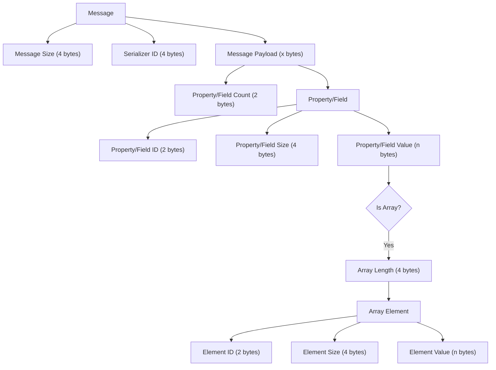

# \[DRAFT] Pipe protocol specification for 'dotnet test' of Microsoft.Testing.Platform

This document outlines the protocol used by 'dotnet test' CLI when communicating with Microsoft.Testing.Platform (MTP) applications.

> [!NOTE]
> Through the document, .NET CLI will be referred to for easy interpretation, but it's not necessarily ".NET CLI".
>
> [!IMPORTANT]
> This document is intended to be used only for internal purposes only. The protocol is not for public usages and we reserve any right to adjust or break as needed.

## General flow

- User invokes 'dotnet test'.
- For every test application, .NET CLI creates a unique pipe server.
- The test application is run with command-line argument specifying the pipe name.
- The test application connects to the given pipe.
- Communication starts.
- Note that child processes may also connect to the same pipe. So it's possible to have multiple connections on the same pipe.

## Common terminology

### `ExecutionId`

For the execution of a test app, the test app and all its child processes are uniquely identified by `ExecutionId`. Per **current implementation**, we can already identify the test app and all its child processes by knowing which pipe is receiving the message. But we are still including `ExecutionId` in the protocol, in case we needed it in future due to implementation changes.

### `InstanceId`

This identifies a "retrying test host". When .NET CLI starts to receive messages a different `InstanceId`, it knows that this is test host that is doing "retry".

## Modes of operation

The test application can operate in one of three modes:

- Help mode (when `--help` is used)
- Discovery mode (when `--list-tests` is used)
- Execution mode (when it actually runs tests, both `--help` and `--list-tests` are not specified)
- TODO(Youssef): Revise MTP behavior if both `--help` and `--list-tests` are specified.

## Handshake

Handshake is the first message expected to be received. During handshake, we negotiate the protocl version to be used. Note that the handshake message is the one that is expected to always be the same for all protocol versions. Future protocol versions MUST not introduce a breaking change to the handshake message. It's not anticipated that we will need to introduce a new versions of protocol though. So far, we only have version "1.0.0". New features are possible to be added to "1.0.0" without breaking changes.

Handshake is expected to happen in all modes. Help, discovery, and execution.
Today, there is an MTP bug that we don't handshake in help mode. This will be worked around in .NET CLI. A fix needs to be done in MTP.

### Handshake request

The handshake request contains multiple properties. Some of which are required by the .NET CLI, and some of them are not required.

- Process ID (optional): The process id sending the handshake.
- Architecture (required): The architecture of the running test application.
- Framework (required): The framework description, as given by `RuntimeInformation.FrameworkDescription`.
- OS (optional): The operating system running the test application.
- Supported protocol versions (required): The protocol versions that are supported by the test application, separated by semicolons.
- Host type (required): The host type which is handshaking with us.
- Module path (required): The path to the test module, either the assembly dll path, or the actual apphost (exe) path.
- ExecutionId (required): Explained above.
- InstanceId (required): Explained above.

### Handshake response

The handshake request contains multiple properties. Some of which are required by the test application, and some of them are not required.

- Process ID (optional): The process id of the .NET CLI.
- Architecture (optional): The architecture of the .NET CLI.
    - TODO(youssef): This shouldn't be needed at all.
- Framework (optional): The framework description of the .NET CLI, as given by `RuntimeInformation.FrameworkDescription`
    - TODO(youssef): This shouldn't be needed at all.
- OS (optional): The operating system running the .NET CLI.
- Supported protocol version: The final protocol version to use. This can be empty/omitted if the .NET CLI doesn't support any of the versions sent during the handshake request.
    - TODO(youssef): How should the version checks happen? Should we consider only the "major" part for deciding compatibility? In what scenarios could we need to only bump minor/patch components? What would it signify and how that info is supposed to be used? Today, we do a full exact version check.

## Command line options

This message is expected to be received only in help mode.

The test app MUST NOT send this message in discovery or execution modes.

The message has the following properties:

- Module path
    - TODO(youssef): Is it optional or required?
- List of command-line options, each command-line option has the following properties
    - Name (required)
    - Description (optional)
    - IsHidden (optional): .NET CLI can assume "false" if it's not present.
    - IsBuiltIn: TODO(youssef) optional or required? If not present, how should we treat it?

## Discovery message

Indicates that the test app discovered a test or multiple tests.

- When running in "discovery" mode, the test app MIGHT send these messages.
    - The absence of these messages in discovery mode means that the test app doesn't contain any tests.
- When running in "execution" mode, the test app MIGHT send these messages.
- When running in "help" mode, the test app MUST NOT send these messages.

The message has the following properties:

- ExecutionId (required)
- InstanceId
    - TODO(youssef) does it make sense to actually send InstanceId for discovery? How is this ever intended to be used?
- List of individual discovered tests. Each discovered test has the following properties:
    - Uid (required)
    - DisplayName (required)

## Test result message

Indicates that the test app completed running a test or multiple tests.

- When running in "discovery" mode, the test app MUST NOT send these messages.
- When running in "execution" mode, the absence of these messages mean that the test app doesn't have any tests.
- When running in "help" mode, the test app MUST NOT send these messages.

This message contains the following properties:

- ExecutionId (required)
- InstanceId (required)
- List of successful test messages. Each successful test message has the following properties:
    - Uid (required)
    - DisplayName (required)
    - State (required)
    - Duration (optional)
    - Reason (optional)
    - Standard output (optional)
    - Standard error (optional)
    - SessionUid (optional or required?)
- List of failed test messages. Each failed test message has the following properties:
    - Uid (required)
    - DisplayName (required)
    - State (required)
    - Duration (optional)
    - Reason (optional)
    - List of exceptions (optional). Each exception has:
        - message (optional or required?)
        - type (optional or required?)
        - stack trace (optional or required?)
    - Standard output (optional)
    - Standard error (optional)
    - SessionUid (optional or required?)

## File artifact message

- When running in "discovery" mode, the test app MUST NOT send these messages.
- When running in "execution" mode, the test app MIGHT send these messages.
- When running in "help" mode, the test app MUST NOT send these messages.

- ExecutionId (required)
- InstanceId (required)
- List of file artifact messages. Each has the following properties:
    - Full path (?)
    - DisplayName (?)
    - Description (?)
    - TestUid (?)
    - TestDisplayName (?)
    - SessionUid (?)

## Test session event message

TODO(Youssef): Verify if this should be sent during help or discovery modes.

This message denotes test events. Currently, there are two events, start and end. This message has the following properties:

- Event type (required): start or end.
- SessionUid (?)
- ExecutionId (required)

## Implementation guidelines

- Failing to receive any "required" property in the protocol is an error that should be clearly surfaced to the user.
- All messages coming from a single test application should have the same ExecutionId. Receiving a different ExecutionId for the same test app is an error.
- Receiving a non-handshake message with InstanceId that wasn't seen in a previous handshake is a protocol violation.
- No messages should ever be attempted to be decoded or received before the handshake message.
    - If we don't know the protocol version yet, we cannot deserialize anything other than handshake!
    - Implementations must NOT deserialize messages and *then* complaining that handshake wasn't received. The deserialization shouldn't be attempted in the first place!
    - So, when receiving a message, we read first 4 bytes as message size, then next 4 bytes denoting serializer id. If serializer id doesn't correspond to handshake serializer id, **don't** continue deserialization and fail immediately.
- All handshake requests from a given test app should have the same ExecutionId, module path, and supported protocols versions.
    - TODO(youssef): Should we have the same architecture, framework description, and OS as well?
    - TODO(youssef): Can we receive multiple handshakes with HostType=TestHostController?
- It's allowed to get multiple handshakes with HostType=TestHost, either with the same InstanceId (indicating sharding), or different InstanceId (indicating retry)
- If .NET CLI is not in "help" mode, then it's not expected to receive command line options message.
- MTP has a bug today where no handshake is done when in help mode. .NET CLI implementation will account for this bug by not requiring a handshake in this case. However, when this bug is fixed, we will have special HostType (e.g, "HelpHost").
    - If handshake with HelpHost is received, then the only expected message is command line options message.
    - If handshake with different HostType is received, then it's not expected to receive command line options messages.
- Discovery messages are only intended to be received by HostType=TestHost. It's a violation if it's received from a different host type.
- Test result messages are only intended to be received by HostType=TestHost. It's a violation if it's received from a different host type.
- File artifact messages can be received by either TestHost or TestHostController.
- Discovery messages, test result messages, and file artifact messages can only be received after a test session event with event type start.
- Discovery messages, test result messages, and file artifact messages cannot be received after a test session event with event type finish.
- Test session start/finish must not be received multiple times
    - TODO(youssef): Any hot reload concerns by blocking this scenario? If we don't block this scenario, what should we do?
- test session event messages must be received by HostType=TestHost
    - TODO(youssef): are these messages sent by other host types as well?
- Failing to receive test session start or finish message is an error.
- Open question: For "unknown" messages? What is the best to do to preserve the max possible compatibility?
    - Today: when .NET CLI receives an "unknown serializer id", it skips reading this message, and it responds with VoidResponse.
    - If the expected response of this message on MTP side is not VoidResponse, then MTP will fail with InvalidCastException.
    - We might have two different scenarios here:
        - A future MTP request **really** requires a response, and MTP cannot move forward without a response. In this case, we cannot do anything. It's a breaking change.
        - A future MTP request might not really require a response. In this case, VoidResponse can be a meaning of ".NET CLI didn't recognize the request".
        - However, this brings ambiguity. If a future MTP message isn't recognized by .NET CLI, and MTP is already expecting VoidResponse.
            - There is no way to tell if .NET CLI understood our message or not.
            - Could it be important for MTP to know whether or not .NET CLI understood the request?
            - In this case, should we have a "special" response that means "I didn't understand your request"?
            - I think such special response gives us the most flexibility.

## General protocol message format

- 4 bytes: message size
- 4 bytes: serializer id (indicator of the message type)
- x bytes: message payload
    - property/field count (2 bytes)
    - for each property/field:
        - property/field id (2 bytes)
        - property/field size (4 bytes)
        - property/field value (n bytes)
            - If the value is an "array":
                - array length (4 bytes)
                - each array element follows again the message payload format (id, size, and value).

## Future considerations

- Youssef: Can we get rid of InstanceId completely? I personally don't believe it was the right design.
    - If we want to simply track retries, that could simply have been a metadata on test results.
    - Having it as a metadata on test results even allows for in-process retries to be reported.
    - Unfortunately, removing InstanceId is going to be a breaking change in the protocol.
    - What we could do?
        - Keep InstanceId for compatibility.
        - Add the metadata on test results as "another" way of knowing retries.
        - In handshake request, tell .NET CLI that we have the "new" way of knowing retries.
        - In handshake request, .NET CLI tells us that is knows the "new" way of knowing retries
            - This step is not needed if we are able to make this change before .NET 10 GA.
        - If both sides can understand the "new" way of knowing retries, InstanceId could then be skipped completely by both sides.
        - If the test app or .NET CLI can't understand the "new" way of knowing retries, InstanceId is kept.
        - Once most users are using a versions that can both understand the "new" way of knowing retries, we can then remove InstanceId from the protocol completely.
        - Note that the platform will now need to provide a way for extensions/frameworks to indicate retries. Maybe just a special cased TestMetadataProperty?
        - The .NET CLI experience will need to be adjusted.
        - CONSIDER: Do we still need some sort of informing retries during handshake?
            - Maybe part of orchestrator handshake?
