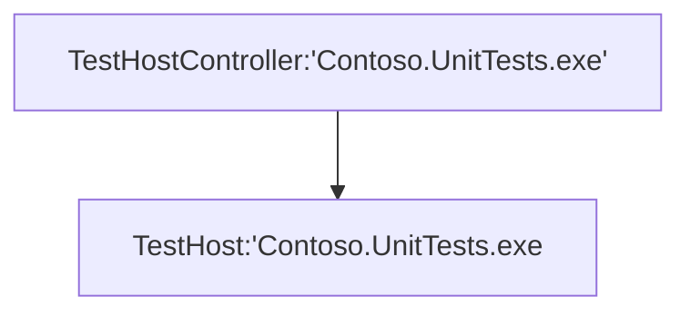

# High level architecture

To introduce the new testing platform, we will use the classic console application (for Windows) as the host. The samples in this document will be written in C#, but you can use the testing platform with any language that supports the .NET Ecma specification. To use the platform, simply reference the `Microsoft.Testing.Platform.dll` assembly, which can be consumed through the official NuGet package available at <https://www.nuget.org/packages/Microsoft.Testing.Platform>.

Let's suppose to have a test console project `Contoso.UnitTests.exe`

```c#
var testApplicationBuilder = await TestApplication.CreateBuilderAsync(args);
testApplicationBuilder.RegisterTestFramework(...test framework registration factories...);
using var testApplication = await testApplicationBuilder.BuildAsync();
return await testApplication.RunAsync();
```

The aforementioned code includes everything needed to execute a test session. However, please note that the code for registering the test framework `RegisterTestFramework` (e.g., MSTest) is not shown here and will be explained in later sections.

As soon as we run the application, a standard Windows process will be created, and the runtime will interact with the registered testing framework to execute the testing session.

The in memory process layout will be a single process:


The testing platform includes a built-in display device that will write the testing session information in the terminal, similar to:

```bash
Microsoft(R) Testing Platform Execution Command Line Tool
Version: 1.1.0+8c0a8fd8e (UTC 2024/04/03)
RuntimeInformation: win-x64 - .NET 9.0.0-preview.1.24080.9
Copyright(c) Microsoft Corporation.  All rights reserved.
Passed! - Failed: 0, Passed: 1, Skipped: 0, Total: 1, Duration: 5ms - Contoso.UnitTests.dll (win-x64 - .NET 9.0.0-preview.1.24080.9)
```

When working in the testing space, it is common to collect information from test sessions to evaluate code quality.
One way to do this is by gathering code coverage metrics, which help us understand if our test suite covers all the code that is being shipped in production.
Collecting code coverage, as well as other extensions, may require special configurations, such as setting up environment variables for the test host.

The testing platform accommodates the registration of both **in-process** and **out-of-process** extensions. It is the responsibility of the testing runtime to manage the processing model appropriately.

In the following example, we will demonstrate how to register a code coverage feature using a **TestHostController** extension.

```c#
var testApplicationBuilder = await TestApplication.CreateBuilderAsync(args);
testApplicationBuilder.RegisterTestFramework(...test framework registration factories...);
testApplicationBuilder.AddCodeCoverage();
using var testApplication = await testApplicationBuilder.BuildAsync();
return await testApplication.RunAsync();
```

The `testApplicationBuilder.AddCodeCoverage();` will internally use the **TestHostController** extensibility point.

```c#
public static class TestApplicationBuilderExtensions
{
    public static ITestApplicationBuilder AddCodeCoverage(this ITestApplicationBuilder testApplicationBuilder)
    {
        testApplicationBuilder.TestHostControllers.AddEnvironmentVariableProvider(...);
        ....
        return testApplicationBuilder;
    }
}
```

The parameters for the api `AddEnvironmentVariableProvider` will be explained in later sections.

When we run the application this time, the runtime will start the `Contoso.UnitTests.exe` process as shown in the previous sample. However, it will also detect that a test host controller extension is registered. As a result, it will restart another instance of the `Contoso.UnitTests.exe` process as a child process. This is done to properly set the environment variables as required by the extension registered with the `AddEnvironmentVariableProvider` API.

The in memory processes layout will be:



> [!NOTE]
> The provided example assumes a console application layout, which handles the restart process correctly and propagates all command line arguments to the child process.
> If you are using a different host, you need to ensure that the entry point code correctly forwards the process entry point (the "Main") to the appropriate code block.
> The runtime simply restarts itself with the same command line arguments.

The above section provides a brief introduction to the architecture of the testing platform. The current extensibility points are divided into two categories:

1. **In process** extensions that can be accessed via the `TestHost` property of the test application builder.

```cs
ITestApplicationBuilder testApplicationBuilder = await TestApplication.CreateBuilderAsync(args);
testApplicationBuilder.TestHost.AddXXX(...);
```

1. **Out of process** extensions that can be accessed via the `TestHostControllers` property of the test application builder.

```cs
ITestApplicationBuilder testApplicationBuilder = await TestApplication.CreateBuilderAsync(args);
testApplicationBuilder.TestHostControllers.AddXXX(...);
```
