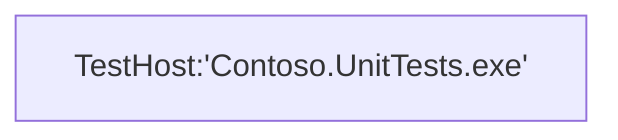

# High level architecture

To introduce the new testing platform, we will use the classic console application (for Windows) as the host. The samples in this document are written in C#, but you can use the testing platform with any language that supports the .NET Ecma specification, and run on any OS supported by .NET. To use the platform, simply reference the `Microsoft.Testing.Platform.dll` assembly, which can be consumed through the official NuGet package available at <https://www.nuget.org/packages/Microsoft.Testing.Platform>.

In a console project `Contoso.UnitTests.exe` the following `Main` method defines the entry point:

```c#
public static async Task<int> Main(string[] args)
{
    var testApplicationBuilder = await TestApplication.CreateBuilderAsync(args);
    testApplicationBuilder.RegisterTestFramework(/* test framework registration factories */);
    using var testApplication = await testApplicationBuilder.BuildAsync();
    return await testApplication.RunAsync();
}
```

This code includes everything needed to execute a test session, except for registering a test framework such as MSTest through `RegisterTestFramework`. This code is shown and explained in later sections.

Please also note that in a typical setup this code is automatically generated through MSBuild, and is not visible in your project. By typical setup we mean for example generating new project from .NET 9 `mstest` template via `dotnet new mstest`.

When `Contoso.UnitTests.exe` application is started a standard Windows process is created, and the testing platform interacts with the registered testing framework to execute the testing session.

A single process is created to carry out this work:



The testing platform includes a built-in display device that writes the testing session information in the terminal, similar to:

```bash
Microsoft(R) Testing Platform Execution Command Line Tool
Version: 1.1.0+8c0a8fd8e (UTC 2024/04/03)
RuntimeInformation: win-x64 - .NET 9.0.0-preview.1.24080.9
Copyright(c) Microsoft Corporation.  All rights reserved.
Passed! - Failed: 0, Passed: 1, Skipped: 0, Total: 1, Duration: 5ms - Contoso.UnitTests.dll (win-x64 - .NET 9.0.0-preview.1.24080.9)
```

## Observing a test host

Test runs commonly collect code coverage information, or similar information to evaluate code quality. Such workloads may require configuration to be done before the test host process starts, for example setting environment variables.

The testing platform accommodates this by having **out-of-process** extensions. When running with an out-of-process extensions, the testing platform will start multiple processes and it will manage them appropriately.

The following example demonstrates how to register a code coverage feature using a **TestHostController** extension.

```c#
var testApplicationBuilder = await TestApplication.CreateBuilderAsync(args);
testApplicationBuilder.RegisterTestFramework(/* test framework registration factories */);
testApplicationBuilder.AddCodeCoverage();
using var testApplication = await testApplicationBuilder.BuildAsync();
return await testApplication.RunAsync();
```

The `testApplicationBuilder.AddCodeCoverage();` internally uses the **TestHostController** extensibility point, which is an out-of-process extensibility point.

```c#
public static class TestApplicationBuilderExtensions
{
    public static ITestApplicationBuilder AddCodeCoverage(this ITestApplicationBuilder testApplicationBuilder)
    {
        testApplicationBuilder.TestHostControllers.AddEnvironmentVariableProvider(...);
        ....
        return testApplicationBuilder;
    }
}
```

The parameters for the api `AddEnvironmentVariableProvider` will be explained in later sections.

When we run `Contoso.UnitTests.exe` this time, the testing platform detects that a `TestHostController` extension is registered. As a result, it starts another instance of the `Contoso.UnitTests.exe` process as a child process. This is done to properly set the environment variables as required by the extension registered with the `AddEnvironmentVariableProvider` API.

The process layout looks like this:


> [!NOTE]
> The provided example assumes a console application layout, which handles the start process correctly and propagates all command line arguments to the child process.
> If you are using a different host, you need to ensure that the entry point code correctly forwards the process entry point (the "Main") to the appropriate code block.
> The runtime simply starts itself with the same command line arguments.

The above section provides a brief introduction to the architecture of the testing platform. The current extensibility points are divided into two categories:

1. **In process** extensions can be accessed through the `TestHost` property of the test application builder. In process means that they will run in the same process as the test framework.

```cs
ITestApplicationBuilder testApplicationBuilder = await TestApplication.CreateBuilderAsync(args);
testApplicationBuilder.TestHost.AddXXX(...);
```

1. **Out of process** extensions can be accessed through the `TestHostControllers` property of the test application builder. These extensions run in a separate process from the test framework to "observe" it.

```cs
ITestApplicationBuilder testApplicationBuilder = await TestApplication.CreateBuilderAsync(args);
testApplicationBuilder.TestHostControllers.AddXXX(...);
```
