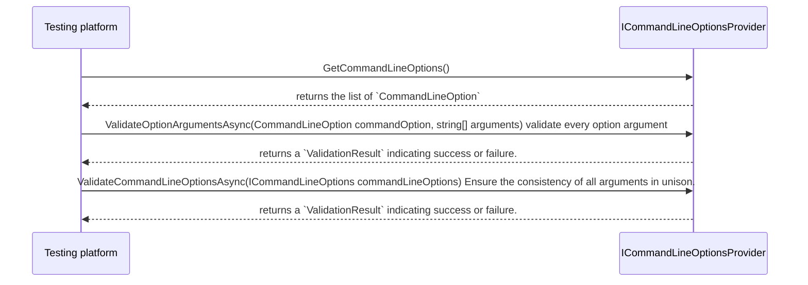

# The `ICommandLineOptionsProvider` interface

As discussed in the [architecture](architecture.md) section, the initial step involves creating the `ITestApplicationBuilder` to register the testing framework and extensions with it.

```cs
...
var testApplicationBuilder = await TestApplication.CreateBuilderAsync(args);
...
```

The `CreateBuilderAsync` method accepts an array of strings (`string[]`) named `args`. These arguments can be used to pass command-line options to all components of the testing platform (including built-in components, testing frameworks, and extensions), allowing for customization of their behavior.

Typically, the arguments passed are those received in the standard `Main(string[] args)` method. However, if the hosting environment differs, any list of arguments can be supplied.

Arguments **must be prefixed** with a double dash `--`. For example, `--filter`.

If a component such as a testing framework or an extension point wishes to offer custom command-line options, it can do so by implementing the `ICommandLineOptionsProvider` interface. This implementation can then be registered with the `ITestApplicationBuilder` via the registration factory of the `CommandLine` property, as shown:

```cs
...
testApplicationBuilder.CommandLine.AddProvider(() => new CustomCommandLineOptions());
...
```

In the example provided, `CustomCommandLineOptions` is an implementation of the `ICommandLineOptionsProvider` interface, This interface comprises the following members and data types:

```cs
public interface ICommandLineOptionsProvider : IExtension
{
    IReadOnlyCollection<CommandLineOption> GetCommandLineOptions();
    Task<ValidationResult> ValidateOptionArgumentsAsync(CommandLineOption commandOption, string[] arguments);
    Task<ValidationResult> ValidateCommandLineOptionsAsync(ICommandLineOptions commandLineOptions);
}

public sealed class CommandLineOption
{
    public CommandLineOption(string name, string description, ArgumentArity arity, bool isHidden)
    public string Name { get; }
    public string Description { get; }
    public ArgumentArity Arity { get; }
    public bool IsHidden { get; }
}

public interface ICommandLineOptions
{
    bool IsOptionSet(string optionName);
    bool TryGetOptionArgumentList(string optionName, out string[]? arguments);
}
```

As observed, the `ICommandLineOptionsProvider` extends the [`IExtension`](iextension.md) interface. Therefore, like any other extension, you can choose to enable or disable it using the `IExtension.IsEnabledAsync` API.

The order of execution of the `ICommandLineOptionsProvider` is:



Let's examine the apis and their mean:

`ICommandLineOptionsProvider.GetCommandLineOptions()`: This method is utilized to retrieve all the options offered by the component. Each `CommandLineOption` requires the following properties to be specified:

`string name`: This is the option's name, presented without a dash. For example, *filter* would be used as `--filter` by users.

`string description`: This is a description of the option. It will be displayed when users pass `--help` as an argument to the application builder.

`ArgumentArity arity`: The arity of an option is the number of values that can be passed if that option or command is specified. Current available arities are:

* `Zero`: Represents an argument arity of zero.
* `ZeroOrOne`: Represents an argument arity of zero or one.
* `ZeroOrMore`: Represents an argument arity of zero or more.
* `OneOrMore`: Represents an argument arity of one or more.
* `ExactlyOne`: Represents an argument arity of exactly one.

For examples, refer to the [System.CommandLine arity table](https://learn.microsoft.com/en-us/dotnet/standard/commandline/syntax#argument-arity).

`bool isHidden`: This property signifies that the option is available for use but will not be displayed in the description when `--help` is invoked.

`ICommandLineOptionsProvider.ValidateOptionArgumentsAsync`: This method is employed to *validate* the argument provided by the user.

For instance, if we have a parameter named `--dop` that represents the degree of parallelism for our custom testing framework, a user might input `--dop 0`. In this scenario, the value 0 would be invalid because we anticipate a degree of parallelism of 1 or more. By using `ValidateOptionArgumentsAsync`, we can perform upfront validation and return an error message if necessary.
A possible implementation for the sample above could be:

```cs
    public Task<ValidationResult> ValidateOptionArgumentsAsync(CommandLineOption commandOption, string[] arguments)
    {
        if (commandOption.Name == "dop")
        {
            if (!int.TryParse(arguments[0], out int dopValue) || dopValue <= 0)
            {
                return ValidationResult.InvalidTask("--dop must be a positive integer");
            }
        }

        return ValidationResult.ValidTask;
    }
```

`ICommandLineOptionsProvider.ValidateCommandLineOptionsAsync`: This method is called as last one and allows to do global coherency check.

For example, let's say our testing framework has the capability to generate a test result report and save it to a file. This feature is accessed using the `--generatereport` option, and the filename is specified with `--reportfilename myfile.rep`. In this scenario, if a user only provides the `--generatereport` option without specifying a filename, the validation should fail because the report cannot be generated without a filename.
A possible implementation for the sample above could be:

```cs
    public Task<ValidationResult> ValidateCommandLineOptionsAsync(ICommandLineOptions commandLineOptions)
    {
        bool generateReportEnabled = commandLineOptions.IsOptionSet(GenerateReportOption);
        bool reportFileName = commandLineOptions.TryGetOptionArgumentList(ReportFilenameOption, out string[]? _);

        return (generateReportEnabled || reportFileName) && !(generateReportEnabled && reportFileName)
            ? ValidationResult.InvalidTask("Both `--generatereport` and `--reportfilename` need to be provided simultaneously.")
            : ValidationResult.ValidTask;
    }
```

Please note that the `ValidateCommandLineOptionsAsync` method provides the [`ICommandLineOptions`](icommandlineoptions.md) service, which is used to fetch the argument information parsed by the platform itself.
