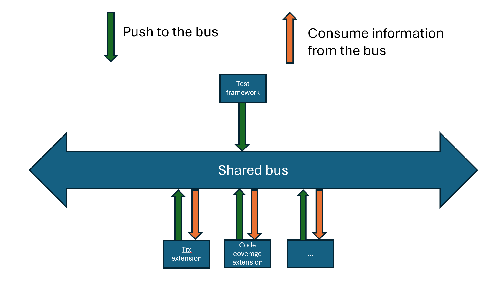

# The `IMessageBus`

The message bus service is the central mechanism that facilitates information exchange between the test framework and its extensions.

The message bus of the testing platform employs the publish-subscribe pattern, as described here: <https://en.wikipedia.org/wiki/Publish%E2%80%93subscribe_pattern>.

The overarching structure of the shared bus is as follows:



As illustrated in the diagram, which includes an extensions and a test framework, there are two potential actions: pushing information to the bus or consuming information from the bus.

The `IMessageBus` satisfied the *pushing action* to the bus and the api is:

```cs
public interface IMessageBus
{
    Task PublishAsync(IDataProducer dataProducer, IData data);
}

public interface IDataProducer : IExtension
{
    Type[] DataTypesProduced { get; }
}

public interface IData
{
    string DisplayName { get; }
    string? Description { get; }
}
```

Let's discuss the parameters:

* `IDataProducer`: The `IDataProducer` communicates to the message bus the `Type` of information it can supply and establishes ownership through inheritance from the base interface [IExtension](iextension.md). This implies that you can't indiscriminately push data to the message bus; you must declare the data type produced in advance. If you push unexpected data, an exception will be triggered.

* `IData`: This interface serves as a placeholder where you only need to provide descriptive details such as the name and a description. The interface doesn't reveal much about the data's nature, which is intentional. It implies that the test framework and extensions can push any type of data to the bus, and this data can be consumed by any registered extension or the test framework itself.
This approach facilitates the evolution of the information exchange process, preventing breaking changes when an extension is unfamiliar with new data. **It allows different versions of extensions and the test framework to operate in harmony, based on their mutual understanding**.

The opposite end of the bus is what we refer to as a [consumer](idataconsumer.md), which is subscribed to a specific type of data and can thus consume it.

> [!IMPORTANT]
> Always use *await* the call to `PublishAsync`. If you don't, the `IData` might not be processed correctly by the testing platform and extensions, which could lead to subtle bugs. It's only after you've returned from the *await* that you can be assured that the `IData` has been queued for processing on the message bus. Regardless of the extension point you're working on, ensure that you've awaited all `PublishAsync` calls before exiting the extension. For example, if you're implementing the [`testing framework`](itestframework.md), you should not call `Complete` on the [requests](irequest.md) until you've awaited all `PublishAsync` calls for that specific request.
