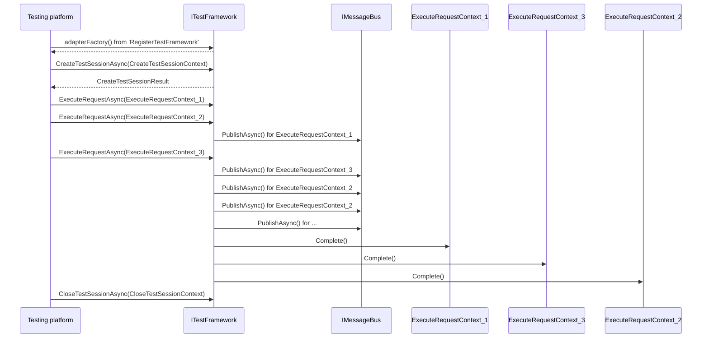

# Implement the Microsoft.Testing.Platform.Extensions.TestFramework.ITestFramework

The `Microsoft.Testing.Platform.Extensions.TestFramework.ITestFramework` is implemented by extensions that provide a test framework:

```cs
public interface ITestFramework : IExtension
{
    Task<CreateTestSessionResult> CreateTestSessionAsync(CreateTestSessionContext context);
    Task ExecuteRequestAsync(ExecuteRequestContext context);
    Task<CloseTestSessionResult> CloseTestSessionAsync(CloseTestSessionContext context);
}
```

The `ITestFramework` interface inherits from the [IExtension](iextension.md) interface, which is an interface that all extension points inherit from. `IExtension` is used to retrieve the name and description of the extension. The `IExtension` also provides a way to dynamically enable or disable the extension in setup, through `Task<bool> IsEnabledAsync()`, please make sure that you return `true` from this method if you have no special needs.

## CreateTestSessionAsync

The `CreateTestSessionAsync` is called at the start of the test session and is used to initialize the test framework. As we can see the api accepts a `CloseTestSessionContext` object and returns a `CloseTestSessionResult`.

```cs
public sealed class CreateTestSessionContext : TestSessionContext
{
    public SessionUid SessionUid { get; }
    public ClientInfo Client { get; }
    public CancellationToken CancellationToken { get; }
}

public readonly struct SessionUid
{
    public string Value { get; }
}

public sealed class ClientInfo
{
    public string Id { get; }
    public string Version { get; }
}
```

The `SessionUid` serves as the unique identifier for the current test session, providing a logical connection to the session's results.
The `ClientInfo` provides details about the entity invoking the test framework. This information can be utilized by the test framework to modify its behavior. For example, as of the time this document was written, a console execution would report a client name such as "testingplatform-console".
The `CancellationToken` is used to halt the execution of `CreateTestSessionAsync`.

The return object is a `CloseTestSessionResult`:

```cs
public sealed class CreateTestSessionResult
{
    public string? WarningMessage { get; set; }
    public string? ErrorMessage { get; set; }
    public bool IsSuccess { get; set; }
}
```

The `IsSuccess` can be used to indicate whether the session creation was successful. If it returns false, the test execution will be halted.

## CloseTestSessionAsync

The `CloseTestSessionAsync` mirrors the `CreateTestSessionAsync` in functionality, with the only difference being the object names. For more details, refer to the `CreateTestSessionAsync` section.

## ExecuteRequestAsync

The `ExecuteRequestAsync` accepts an object of type `ExecuteRequestContext`. This object, as suggested by its name, holds the specifics about the action that the test framework is expected to perform.
The `ExecuteRequestContext` definition is:

```cs
public sealed class ExecuteRequestContext
{
    public IRequest Request { get; }
    public IMessageBus MessageBus { get; }
    public CancellationToken CancellationToken { get; }
    public void Complete();
}
```

`IRequest`: This is the base interface for any type of request. We should think about the test framework as an **in-process statefull server** where the lifecycle is:



The diagram above illustrates that the testing platform issues 3 requests after creating the test framework instance. The test framework processes these requests and utilizes the `IMessageBus` service, which is included in the request itself, to deliver the result for each specific request. Once a particular request has been handled, the test framework invokes the `Complete()` method on it, indicating to the testing platform that the request has been fulfilled.
The testing platform monitors all dispatched requests. Once all requests have been fulfilled, it invokes `CloseTestSessionAsync` and disposes of the instance (if `IDisposable/IAsyncDisposable` is implemented).
It's evident that the requests and their completions can overlap, enabling concurrent and asynchronous execution of requests.
>> [!NOTE]
>> Currently, the testing platform does not send overlapping requests and waits for the completion of a request >> before sending the next one. However, this behavior may change in the future.
>> The support for concurrent requests will be determined through the [capabilities](capabilities.md) system.

The `IRequest` implementation specifies the precise request that needs to be fulfilled. The test framework identifies the type of request and handles it accordingly. If the request type is unrecognized, an exception should be raised.

You can find details about the available requests in the [IRequest](irequest.md) section.

`IMessageBus`: This service, linked with the request, allows the test framework to *asynchronously* to publish information about the ongoing request to the testing platform.
The message bus serves as the central hub for the platform, facilitating asynchronous communication among all platform components and extensions.
For a comprehensive list of information that can be published to the testing platform, refer to the [IMessageBus](imessagebus.md) section.

`CancellationToken`: This token is utilized to interrupt the processing of a particular request.

`Complete()`: As depicted in the previous sequence, the `Complete` method notifies the platform that the request has been successfully processed and all relevant information has been transmitted to the [IMessageBus](imessagebus.md).
>> [!WARNING]
>> Neglecting to invoke `Complete()` on the request will result in the test application becoming unresponsive.

To customize your test framework according to your requirements or those of your users, you can use a personalized section inside the [configuration](configuration.md) file or with custom [command line options](icommandlineoptions.md).

A practical example of a test framework can be found in the [code sample](codesample.md) section.
