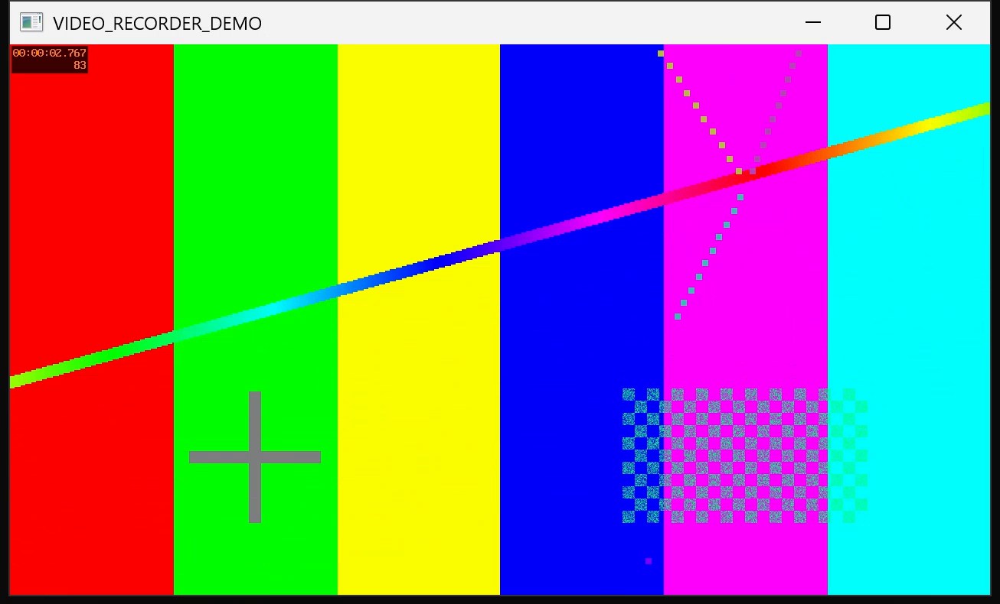

# Video Recorder extension (sample)

A Microsoft.Testing.Platform (MTP) extension that exposes a small **service** letting tests
start/stop **screen recording** while they run. Recording is performed by an external
**ffmpeg** process (the only engine that is cross-platform *and* covers screen capture).
Each produced video is attached to the test session as a file artifact.

This is a local sample (not a shipping package) wired into the `Playground` sample.



## How to play with it

1. Make `ffmpeg` available — either install it and add it to `PATH`, or pass an explicit path
   (see options below). On Windows the recorder uses `gdigrab`, on macOS `avfoundation`, on
   Linux `x11grab`.
2. Build and run the `Playground` sample **with `--capture-video`** (recording is opt-in). It
   contains a demo test (`VideoRecorderDemoTests.RecordDesktopForAFewSeconds`) that records the
   desktop for 3s.
3. Find the video under `<TestResults>/VideoRecordings/` (it is also reported as a session
   artifact at the end of the run). With the default `on-failure` retention, a video from a
   passing run is discarded — use `--capture-video always` to keep it.

## Using it from a test

```csharp
using Microsoft.Testing.Extensions.VideoRecorder;

IVideoRecorder recorder = VideoRecorder.Current;
recorder.Start("my-test");          // begins capturing the screen
// ... drive your UI ...
string? videoPath = await recorder.StopAsync();   // finalizes the .mp4 and returns its path
```

If the extension is not registered, `VideoRecorder.Current` returns a no-op recorder so test
code never throws.

## Registering the extension

```csharp
testApplicationBuilder.AddVideoRecorderProvider(options =>
{
    options.FfmpegPath = @"C:\tools\ffmpeg\bin\ffmpeg.exe"; // optional; defaults to PATH lookup
    options.FrameRate = 15;
    options.Format = VideoRecorderFormat.Mp4H264;           // or WebMVp9 (royalty-free)
    options.PersistMode = VideoRecorderPersistenceMode.OnFailure; // or Always
    options.CaptureCurrentProcessWindow = false;                  // true = capture only this process's window (Windows)
    // options.OutputDirectory = ...;                       // defaults to <TestResults>/VideoRecordings
    // options.InputArgumentsOverride = ...;                // capture a window/region instead of the full screen
    // options.ExtraRecorderArguments = "-vf scale=1280:-1"; // extra args for the underlying recorder (ffmpeg)
});
```

Registration only makes the option available — recording is still **opt-in** and happens only
when the run is started with `--capture-video`.

## Command-line options

Recording is enabled per-run with a single flag, mirroring the platform's `--report-<kind>`
grouping. The `--capture-<kind>-…` prefix leaves room for a future capture kind — for example
screenshots — under the same `--capture-` umbrella (e.g. `--capture-screenshot`).

| Option | Values | Description |
| --- | --- | --- |
| `--capture-video` | *(none)*, `on-failure`, `always` | Enables screen recording for the run. The optional argument controls retention: `on-failure` (**default** — keep the video only if at least one test fails) or `always`. |
| `--capture-video-window` | *(flag)* | Capture only the **current process window** instead of the full screen. Windows only (uses `gdigrab title=`); falls back to full-screen capture elsewhere. Requires `--capture-video`. |
| `--capture-video-args` | any string | Extra arguments passed to the underlying recorder (currently ffmpeg), as output/encoding options. Requires `--capture-video`. |

Examples:

```bash
# Record, keeping the video only if a test fails (default)
yourtests --capture-video

# Record and always keep the video
yourtests --capture-video always

# Record only the current process window (e.g. your terminal) instead of the whole screen
yourtests --capture-video always --capture-video-window

# Record and pass extra recorder args. NOTE: because the value starts with '-', you must use the
# '=' (or ':') delimiter form so MTP binds it to the option instead of parsing it as a new option.
yourtests --capture-video "--capture-video-args=-vf scale=1280:-1"
# (equivalently, quote just the value:  --capture-video-args="-vf scale=1280:-1")
```

> **Window capture** records the screen rectangle of a window resolved in this order: the process
> **main window** (a GUI app under test owns it), then the **foreground window** (the terminal you
> launched from — this is what lets it capture **Windows Terminal**, whose window isn't owned by
> the test process), then the **console window** (classic conhost). If none is a usable visible
> window (e.g. a headless/CI run), it **falls back to full-screen capture** with a logged note.
> Because the foreground window is read when recording starts, keep your terminal focused as the
> run begins.
>
> Screen capture also requires an **accessible interactive desktop**. On a locked screen, a
> disconnected RDP session, or a session-0 service, `gdigrab` fails with "access denied" and no
> video is produced — the recorder logs this and the run continues.

> Retention is decided at **session** granularity: if any test in the run fails, all recordings
> produced during the run are kept; if every test passes, they are all discarded.

> The `on-failure` mode decides at **session** granularity: if any test in the run fails, all
> recordings produced during the run are kept; if every test passes, they are all discarded.

## A note on ffmpeg licensing / codecs

- `Mp4H264` uses `libx264`, which is GPL in most ffmpeg builds and H.264 carries patent fees —
  fine when you bring your own ffmpeg on `PATH`, but not something to bundle/redistribute.
- `WebMVp9` uses `libvpx-vp9`, which is royalty-free and LGPL/BSD-clean — the safe choice if an
  ffmpeg binary is ever shipped alongside the extension.
